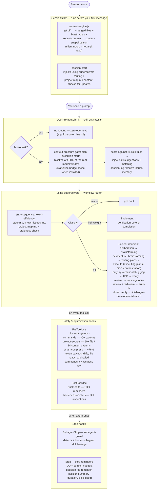

<div align="center">

[]()

[](https://github.com/brunob54/superpowers-orchestrator/stargazers)
[](RELEASE-NOTES.md)
[](LICENSE)
[](https://github.com/brunob54/superpowers-orchestrator#installation)

</div>

# Superpowers Orchestrator

**Superpowers** is a plugin for coding agents (Claude Code, Cursor, Codex, OpenCode) that adds a disciplined development workflow: a design specification first, then a task plan, then test-driven implementation with staged code reviews. The workflow is implemented as *skills* (instruction files the agent follows) and *hooks* (scripts that run automatically at session events).

This repository is a fork of [obra/superpowers](https://github.com/obra/superpowers) via [REPOZY/superpowers-optimized](https://github.com/REPOZY/superpowers-optimized). Its own contribution is **orchestration**: the same workflow can run autonomously from an approved specification to a merge-ready branch, with independent review rounds between stages — see [What this repo adds](#what-this-repo-adds).

> [!TIP]
> **New to the plugin?** Start with the [User Guide](docs/guide/README.md) — the day-to-day operating manual: workflows, trigger phrases, autonomous runs, and recovery.

> [!NOTE]
> **Lineage & status:** this repository builds on two origins — the original [obra/superpowers](https://github.com/obra/superpowers) by Jesse Vincent and its optimized fork [REPOZY/superpowers-optimized](https://github.com/REPOZY/superpowers-optimized) (baseline v6.6.1). Full credit to both. The project was named *superpowers-optimized* through v6.15.1 and was renamed to **superpowers-orchestrator** at v7.0.0, to match its main feature: the autonomous orchestration pipeline. This fork's own additions (v6.7.0–v7.0.0) are **under testing and evaluation** — see [What this repo adds](#what-this-repo-adds).
>
> **How this fork is built:** every release of this fork (v6.7.0–v7.0.0) was designed, implemented, and reviewed end-to-end by Claude Fable 5 running in Claude Code — with the plugin itself driving its own development. (Batched implementation dispatches task subagents on smaller Claude models where the plugin's model-selection rules call for it; design, orchestration, and review stayed on Fable 5.) The fork bootstraps on its own releases: v6.7.0 was built under the parent fork plugin (baseline v6.6.1), and each release since was built with the fork's *previous* release installed. Every workflow described below was used, under real conditions, to build the version you're reading about.

## What this repo adds

Ten releases beyond the REPOZY v6.6.1 baseline. The five main additions — full guide with usage, details, and motivations in [docs/FORK-IMPROVEMENTS.md](docs/FORK-IMPROVEMENTS.md):

- **SDD Batched Autonomous Mode (v6.7.0)** — execute a plan in resumable batches of N tasks, ending each batch at a fixed task cap (the requested count, default 3) with a `state.md` handoff; say "implement the next 3 tasks", then after `/clear`: "resume the plan". [Details](docs/FORK-IMPROVEMENTS.md#1-sdd-batched-autonomous-mode-v670)
- **SDD Token-Optimized Review Flow (v6.8.0)** — port of upstream obra v6.0.0: one two-verdict task reviewer, file-based handoffs under `.superpowers/sdd/`, explicit per-dispatch model selection; automatic whenever subagent-driven-development executes a plan (~2x faster, ~50–60% fewer tokens per upstream measurement). [Details](docs/FORK-IMPROVEMENTS.md#2-sdd-token-optimized-review-flow-v680)
- **multi-doc-review (v6.9.0)** — N independent clean-context review rounds with rotating lenses on every spec and plan before its approval gate, with a sidecar audit log; automatic at the gates, or direct: `/multi-doc-review docs/specs/<doc>.md 3`. [Details](docs/FORK-IMPROVEMENTS.md#3-multi-doc-review--n-round-independent-document-review-v690)
- **multi-code-review (v6.10.0)** — N independent whole-branch code review rounds with rotating lenses (correctness/spec alignment, adversarial red-team, security, test quality) and fixes applied between rounds, with a sidecar audit log; automatic at subagent-driven-development's final review gate, or direct: `/multi-code-review [BASE] [N]`. [Details](docs/FORK-IMPROVEMENTS.md#4-multi-code-review--n-round-independent-whole-branch-code-review-v6100)
- **orchestrating-development (v6.14.0)** — fully autonomous spec-to-merge-gate pipeline: from an approved design spec, runs plan writing, N plan-review rounds, batched implementation, and N code-review rounds via fresh-context controller subagents, stopping only on major errors and ending before merge/PR; one interactive Phase 0 collects review counts, batch cap, and branch/permission confirmations, then say "orchestrate development of docs/specs/<spec>.md". [Details](docs/FORK-IMPROVEMENTS.md#5-orchestrating-development--autonomous-spec-to-merge-gate-pipeline-v6140)

Four further releases — `multi-doc-review` rename (v6.11.0), plan-scoped SDD workspace (v6.12.0), fresh-session plan handoff (v6.13.0), and cap-only batch boundary (v6.15.0) — are covered in [RELEASE-NOTES.md](RELEASE-NOTES.md).

## Inherited from the parent projects

From [REPOZY/superpowers-optimized](https://github.com/REPOZY/superpowers-optimized) (baseline v6.6.1):

- Automatic 3-tier workflow routing (micro / lightweight / full), so overhead stays proportional to task size
- The 10 lifecycle hooks: dangerous-command blocking, secret protection, Bash output compression, skill activation, edit tracking, session statistics, stop reminders, subagent guard (platform-specific subsets on Codex/OpenCode — see the parity note below)
- Security review (OWASP checklist) inside code review, and the red-team agent with its auto-fix pipeline
- The cross-session memory stack: `project-map.md`, `session-log.md`, `state.md`, `known-issues.md`, plus the automatic `context-snapshot.json` written at every session start
- Token-efficiency rules: concise responses, parallel tool calls, exploration tracking

From [obra/superpowers](https://github.com/obra/superpowers) (the original, by Jesse Vincent): the skills framework itself and the core workflow skills — brainstorming, writing plans, test-driven development, systematic debugging, and code review.

## Quick start
In any supported agent IDE, start a new chat and paste:

```
Activate Superpowers Orchestrator and plan a secure user-authentication endpoint with full TDD and security review.
```

The agent will automatically route to the correct workflow, apply safety guards, and run an integrated security review during code review — no manual skill selection required.

See [Installation](#installation) for install, update, and uninstall commands on all platforms.

> [!NOTE]
> **Codex parity boundary:** Claude Code gets the full 10-hook lifecycle. Codex now has verified live support for `SessionStart`, `UserPromptSubmit`, and `PreToolUse(Bash)` on macOS/Linux with `codex_hooks = true` and `codex-cli 0.118.0+` (tested on `0.118.0`). This repo now also ships a Codex-specific `PostToolUse(Bash)` smart-compress hook that can replace noisy Bash output after execution using the existing compression rules. `Stop` is implemented for Codex, but visible reminder surfacing should still be revalidated after install/update. Codex still does **not** expose Claude's `PostToolUse(Edit|Write|Skill)`, `SubagentStop`, `Read/Edit/Write` interception, or Claude's pre-execution Bash rewrite path, so full Claude parity is not possible today.

---

> [!IMPORTANT]
> **Compatibility note:** this plugin ships a workflow router and 27 skills covering debugging, planning, code review, TDD, and execution.
>
> Other plugins or custom skills/agents in your `.claude/skills/` and `.claude/agents/` folders can interfere when they cover the same domains: duplicate skills cause trigger conflicts and contradictory instructions, and every extra skill adds text to the model's context. If you see conflicting behavior, disable the overlapping plugins or skill files.


---

A typical session runs like this. For a non-trivial task, the agent does not start coding immediately: it first asks questions, one section at a time, until a clear specification exists and you approve it.

From the approved design, the agent writes an implementation plan whose tasks follow red/green TDD cycles (write a failing test, make it pass) and stay minimal — no speculative features, no duplicated code.

When you confirm, the plugin routes execution to *subagent-driven-development* or *executing-plans* and runs staged reviews: specification compliance first, then code quality, with security analysis (OWASP checklist) on sensitive changes. For complex logic, the *red-team* agent attacks the code with concrete failure scenarios; each critical finding becomes a failing test, a fix, and a regression check.

**The agent evaluates relevant skills before every task.** The workflows are mandatory, not suggestions, and overhead stays proportional to task complexity:
- **Micro-tasks** bypass all gates entirely
- **Lightweight tasks** receive a single verification checkpoint
- **Full-complexity tasks** engage the complete pipeline

---

## How It Works



## Research-Informed Design

The design decisions in this fork are informed by three research papers on LLM agent behavior. These papers motivated the approach:

### Minimal context files outperform verbose ones

**Paper:** [Evaluating AGENTS.md: Are Repository-Level Context Files Helpful for Coding Agents?](https://arxiv.org/abs/2602.11988) (AGENTbench, 138 tasks, 12 repos, 4 agents)

Key findings that shaped this fork:
- **LLM-generated context files decreased success rates by ~2-3%** while increasing inference costs by over 20%. More instructions made tasks *harder*, not easier.
- **Developer-written context files only helped ~4%** — and only when kept minimal. Detailed directory enumerations and comprehensive overviews didn't help agents find relevant files faster.
- **Agents used 14-22% more reasoning tokens** when given longer context files, suggesting cognitive overload rather than helpful guidance.
- **Agents followed instructions compliantly** (using mentioned tools 1.6-2.5x more often) but this compliance didn't translate to better outcomes.

**What we changed:** Every skill was rewritten as a concise operational checklist instead of verbose prose. The `CLAUDE.md` contains only minimal requirements (specific tooling, critical constraints, conventions). The 3-tier complexity classification (micro/lightweight/full) skips unnecessary skill loading for simple tasks. The result is lower prompt overhead in every session and fewer failures from instruction overload.

### Prior assistant responses can degrade performance

**Paper:** [Do LLMs Benefit from Their Own Words?](https://arxiv.org/abs/2602.24287) (4 models, real-world multi-turn conversations)

Key findings that shaped this fork:
- **Removing prior assistant responses often maintained comparable quality** while reducing context by 5-10x. Models over-condition on their own previous outputs.
- **Context pollution is real:** models propagate errors across turns — incorrect code parameters carry over, hallucinated facts persist, and stylistic artifacts constrain subsequent responses.
- **~36% of prompts in ongoing conversations are self-contained "new asks"** that perform equally well without assistant history.
- **One-sentence summaries of prior responses outperformed full context**, suggesting long reasoning chains degrade subsequent performance.

**What we changed:** The `context-management` skill actively prunes noisy history and persists only durable state across sessions. Subagent prompts request only task-local constraints and evidence rather than carrying forward full conversation history. Execution skills avoid long historical carryover unless required for correctness. The `token-efficiency` standard enforces these rules as an always-on operational baseline.

### Single reasoning chains fail on hard problems

**Paper:** [Self-Consistency Improves Chain of Thought Reasoning in Language Models](https://arxiv.org/abs/2203.11171) (Wang et al., ICLR 2023)

Key findings that shaped this fork:
- **A single chain-of-thought can be confident but wrong** — the model picks one reasoning path and commits, even when that path contains an arithmetic slip, wrong assumption, or incorrect causal direction.
- **Generating multiple independent reasoning paths and taking majority vote significantly improves accuracy** across arithmetic, commonsense, and symbolic reasoning tasks.
- **Consistency correlates with accuracy** — when paths agree, the answer is almost always correct. When they scatter, the problem is genuinely hard or ambiguous, which is itself a useful signal.
- **Diversity of reasoning matters more than quantity** — 5 genuinely different paths outperform 10 paths that all reason the same way.

**What we changed:** The `systematic-debugging` skill now applies self-consistency during root cause diagnosis (Phase 3): before committing to a hypothesis, the agent generates 3-5 independent root cause hypotheses via different reasoning approaches, takes a majority vote, and reports confidence. Low-confidence diagnoses (<= 50% agreement) trigger a hard stop — gather more evidence before touching code. The `verification-before-completion` skill applies the same technique when evaluating whether evidence actually proves the completion claim, catching the failure mode where evidence is interpreted through a single (potentially wrong) lens. The underlying technique lives in `self-consistency-reasoner` and fires only during these high-stakes reasoning moments, keeping the token cost targeted.

### Social accountability and iterative fixing improve agent accuracy

**Research:** [2389.ai research on multi-agent collaboration](https://2389.ai/products/simmer/) and their [claude-plugins repository](https://github.com/2389-research/claude-plugins)

Key findings that shaped this fork:
- **Social accountability language in agent prompts significantly improves accuracy.** Agents told that downstream work depends on their output (e.g. "the fix pipeline acts on your findings — a false positive wastes a full cycle, a missed bug ships") perform measurably better than agents given identical tasks without this framing.
- **Sequential batch fixing is fragile when findings share code.** Fixing all Critical/High findings in one pass without re-assessing between fixes can cause conflicts when multiple findings touch the same functions. An ASI (Actionable Side Information) approach — fix one finding, re-check affected files only, re-prioritize, repeat — prevents fix collisions and converges faster.
- **Deliberation before brainstorming improves architectural decisions.** When the problem itself may be mis-framed or the options aren't well-defined yet, convening named stakeholder perspectives (each speaks once, without debate) surfaces convergence and live tension without forcing a premature choice. This prevents committing to solutions before the right question has been asked.

**What we changed:** Social accountability framing was added to the `code-reviewer`, `red-team`, and `implementer` prompts. The auto-fix pipeline in `requesting-code-review` was rewritten as an ASI-guided iterative loop (fix one finding → targeted re-check of affected files only → re-assess remaining, identify new ASI → repeat). A new `deliberation` skill was added for complex architectural decisions where the problem needs reframing before brainstorming begins.

### Combined impact

These research insights drive five core principles throughout the fork:
1. **Less is more** — concise skills, minimal always-on instructions, and explicit context hygiene
2. **Fresh context beats accumulated context** — subagents get clean, task-scoped prompts instead of inheriting polluted history
3. **Compliance != competence** — agents follow instructions reliably, so the instructions themselves must be carefully engineered (rationalization tables, red flags, forbidden phrases) rather than simply comprehensive
4. **Verify your own reasoning** — multi-path self-consistency at critical decision points (diagnosis, verification) catches confident-but-wrong single-chain failures before they become expensive mistakes
5. **Accountability and iteration** — agents told that their output has real downstream consequences are more accurate; fixing findings one at a time with re-assessment between fixes prevents collisions and converges faster than batch processing


---


## Session Memory

An agent session normally starts with no memory of previous sessions: the AI re-explores structure it already mapped, re-proposes approaches that were already rejected, and re-debugs errors that were already solved. The memory stack removes that repeated work — each session starts knowing what was tried, what was decided and why, and what changed since the last commit.

The plugin builds this memory stack at your project root:

```
context-snapshot.json  ← git blast radius + changed files (written automatically every session)
project-map.md         ← structure + key files + critical constraints (never re-explore)
session-log.md         ← decision history + approach rejections (never re-explain)
known-issues.md        ← error→solution map (never re-debug the same thing)
state.md               ← current task snapshot (never lose mid-work progress)
```

### project-map.md — What exists and what it does

Generate once with "map this project". After that, the session-start hook injects its content directly into every session — no instruction-following required. The AI has the map before your first message arrives.

```markdown
# Project Map
_Generated: 2026-03-20 14:32 | Git: a4b9c2d_

## Directory Structure
skills/ — 27 skills, each in skills/<name>/SKILL.md
hooks/ — 10 hooks (JS) + hooks.json registry + skill-rules.json

## Key Files
hooks/skill-activator.js — UserPromptSubmit: context pressure gate (blocks plan execution at ≥60% context; reads the statusline bridge cache when configured, else session JSONL); skill hints via skill-rules.json; memory recall from session-log.md + known-issues.md. Micro-task detection skips all enrichment.
hooks/skill-rules.json — 25 rules covering 24 skills (context-management has two: map-project and save-state): skill name, keywords, intentPatterns, priority.

## Critical Constraints
- hooks.json uses \" not ' around ${CLAUDE_PLUGIN_ROOT} (single quotes break Linux)
- plugin.json + marketplace.json must always have identical version strings

## Hot Files
hooks/stop-reminders.js, hooks/skill-activator.js, skills/using-superpowers/SKILL.md
```

**Staleness is automatic.** The AI checks the git hash (or file timestamps on non-git projects) at every session start and re-reads only files that actually changed since the map was made. No manual invalidation needed.

Works on any project — git or non-git. If no git is detected during map generation, the AI offers to run `git init` (creates a `.git` folder, touches none of your files). If you decline, it falls back to timestamp comparison instead.

**First-build prompt.** You don't need to remember to generate a map. When you type any creation-intent request ("build me X", "create X", "implement X") in a directory with no `project-map.md`, the AI pauses before starting and explains exactly what it will lose without the memory stack. It offers to set everything up in ~30 seconds. Say yes once — every future session on that project starts with full context.

### context-snapshot.json — What changed right before this session

Written automatically by the `context-engine` hook on every session start. No setup, no action required — it exists before your first message arrives.

```json
{
  "git_hash": "9636c5c",
  "changed_files": ["hooks/context-engine.js", "hooks/hooks.json"],
  "change_stat": "2 files changed, 140 insertions(+)",
  "recent_commits": ["9636c5c Check context-snapshot.json in Phase 1", "..."],
  "blast_radius": {
    "hooks/context-engine.js": ["hooks/hooks.json", "docs/plans/..."]
  }
}
```

Skills that need to know what changed — code review, systematic debugging — read this file first instead of running `git diff` and `git log` themselves. If the snapshot is fresh (git hash matches HEAD), the review scope is pre-verified before the agent starts. If it's stale or absent, skills fall back to git commands directly.

Automatically added to `.gitignore` — it's a tooling artifact, not project code.

### session-log.md — What happened

An optional, manually-maintained record of decisions, rejected approaches, and key facts. Write an entry when something is worth preserving — an architectural choice, a constraint discovered the hard way, an approach that was tried and failed. Skip it when there's nothing durable to record.

| Written by | Contains |
|---|---|
| You, via `context-management` | Goal, decisions, rejected approaches, key facts |

```markdown
## 2026-03-15 10:04 [saved]
Goal: Add cross-session memory to the plugin
Decisions:
- project-map.md injected by the session-start hook directly — makes it unconditional, not dependent on Claude following instructions
- session-log.md is manual-only; auto-entries were low-signal noise, all derivable from git log
Approaches rejected: Auto-appending a [auto] entry on every Stop event — produced 30 near-identical entries per session with no decisions or reasoning, just file lists
Key facts: hooks.json requires \" not ' around ${CLAUDE_PLUGIN_ROOT} — single quotes break variable expansion on Linux
Open: Monitor whether [saved] entries get used in practice; if not, consider folding key facts into project-map.md Critical Constraints instead
```

Write an entry by invoking `context-management`. Only the most recent entries are injected at session start — older entries are lookup-only, surfaced via keyword grep when a task touches the same area. **Entry size directly affects your per-session token cost** — the stop-hook monitors this and warns when entries exceed budget. Keep entries under 115 words.

### known-issues.md — Error memory

Maintained by the `error-recovery` skill. When a bug is solved, invoke `error-recovery` to record the error signature and fix. Before any debugging session, the AI checks `known-issues.md` first — if the error is already mapped, it applies the solution without re-investigating.

```markdown
## Cannot read properties of undefined (reading 'name')
**Error:** TypeError at hooks/skill-activator.js:47
**Root cause:** hooks.json loaded before plugin root env var was set
**Fix:** Ensure ${CLAUDE_PLUGIN_ROOT} is resolved before hook execution; use run-hook.cmd wrapper
**Context:** Windows-only; Linux resolves the var earlier in the process
```

The file grows over time into a project-specific lookup table. The more errors it captures, the less time gets spent re-diagnosing problems that were already solved.

### state.md — Mid-work snapshot

Written by `context-management` when ending a session mid-task. Read at the start of the next session before any work begins. Captures the current goal, active decisions, plan status, evidence, and open questions — so "pick up where we left off" actually works.

```markdown
# State
Current Goal: Add state.md support to context-management skill
Decisions:
- Write at project root alongside project-map.md
- Keep under 100 lines — if longer, not compressed enough
Plan Status:
- [x] Design approved
- [ ] SKILL.md updated
- [ ] README updated
Open: Whether to auto-clear state.md on session start or leave for manual cleanup
```

Unlike `session-log.md`, `state.md` is ephemeral — it represents the current task only and gets overwritten each time you save state. Once a task is complete, it can be discarded.

### The combined impact

Without this stack, every new session starts with no memory of the project:
- The AI re-globs the project to understand its structure
- Re-reads files it already understood last session
- Proposes approaches that were already rejected
- Re-debugs errors that were already solved
- Loses the "why" behind every architectural decision
- Runs git commands to discover what changed — every time, from scratch

With this stack, sessions start with full context and zero re-discovery overhead. The AI greets your task with: *"I see the last session on this topic (2026-03-15) established that single quotes break Linux CI — already writing the new hook with escaped double quotes. The context snapshot shows hooks/context-engine.js changed in the last commit, and hooks/hooks.json references it — scoping the review there first."*

---


## Skills Library (27 skills)

### Core Workflow
- **using-superpowers** — Mandatory workflow router with 3-tier complexity classification (micro/lightweight/full) and instruction priority hierarchy
- **token-efficiency** — Always-on: concise responses, parallel tool batching, exploration tracking, no redundant work
- **context-management** — Four-file memory stack: `project-map.md` (structure + key files + critical constraints, git-hash staleness detection), `session-log.md` (decision history, manually written via `context-management` — [saved] entries only), `state.md` (ephemeral current-task snapshot), `known-issues.md` (error→solution map)

- **premise-check** — Validates whether proposed work should exist before investing in it; triggers reassessment when new evidence changes the original motivation

### Design & Planning
- **deliberation** — Structured decision analysis for complex architectural choices: assembles 3–5 named stakeholder perspectives, each speaks once without debate, then surfaces convergence points and live tensions without forcing a premature conclusion. Use before brainstorming when the problem itself may need reframing
- **brainstorming** — Socratic design refinement with engineering rigor, project-level scope decomposition, and architecture guidance for existing codebases
- **writing-plans** — Executable implementation plans with exact paths, verification commands, TDD ordering, and pre-execution plan review gate
- **claude-md-creator** — Create lean, high-signal CLAUDE/AGENTS context files for repositories

### Execution
- **executing-plans** — Batch execution with verification checkpoints and engineering rigor for complex tasks
- **subagent-driven-development** — Parallel subagent execution with two-stage review gates (spec compliance, then code quality), blocked-task escalation, E2E process hygiene, context isolation, and skill leakage prevention
- **orchestrating-development** — autonomous spec→plan→review→implement→review pipeline; fresh controller subagent per phase/batch; stops only on major errors, ends before merge/PR
- **dispatching-parallel-agents** — Concurrent subagent workflows for independent tasks
- **using-git-worktrees** — Isolated workspace creation on feature branches

### Quality & Testing
- **test-driven-development** — RED-GREEN-REFACTOR cycle with rationalization tables, testing anti-patterns, and advanced test strategy (integration, E2E, property-based, performance)
- **systematic-debugging** — 5-phase root cause process: known-issues check, investigation (reads `context-snapshot.json` first to answer "what changed recently?" without running git commands), pattern comparison, self-consistency hypothesis testing, fix-and-verify
- **verification-before-completion** — Evidence gate for completion claims with multi-path verification reasoning and configuration change verification
- **self-consistency-reasoner** — Internal multi-path reasoning technique (Wang et al., ICLR 2023) embedded in debugging and verification

### Code Health
- **refactoring** — Behavior-locked structural changes: characterization tests before any move, one change at a time with tests green after each, per-category stale reference audit at completion
- **performance-investigation** — Measure-first performance work: quantitative baseline, profiling to find the real bottleneck, hypothesis with predicted improvement, re-measurement after each fix
- **dependency-management** — Incremental dependency updates with verification: audit, impact assessment, one-at-a-time upgrades, lockfile merge conflict resolution, security vulnerability fast-path

### Review & Integration
- **requesting-code-review** — Structured code review with integrated security analysis (OWASP, auth flows, secrets handling, dependency vulnerabilities), adversarial red team dispatch, and ASI-guided iterative auto-fix pipeline for critical findings (fix one → re-check affected files only → re-prioritize → repeat)
- **receiving-code-review** — Technical feedback handling with pushback rules and no-sycophancy enforcement
- **multi-doc-review** — N-round independent spec/plan review: one clean-context reviewer per round under rotating lenses, findings merged between rounds, sidecar audit log; automatic at the brainstorming/writing-plans gates or direct via `/multi-doc-review <doc> [N]`
- **multi-code-review** — N-round independent whole-branch code review: one clean-context reviewer per round under rotating lenses, one fix subagent per round, sidecar audit log; automatic at subagent-driven-development's final review gate or direct via `/multi-code-review [BASE] [N]`
- **finishing-a-development-branch** — 4-option branch completion (merge/PR/keep/discard) with safety gates

### Intelligence
- **error-recovery** — Maintains project-specific `known-issues.md` mapping recurring errors to solutions, consulted before debugging
- **frontend-design** — Design intelligence system with industry-aware style selection, 25 UI styles, 30 product-category mappings, page structure patterns, UI state management, and 10 priority quality standards (accessibility, touch, performance, animation, forms, navigation, charts)

### Hooks (10 total)
This is the full cross-platform hook inventory for the plugin. Claude Code gets the full set. Codex currently wires the smaller `SessionStart` / `UserPromptSubmit` / `PreToolUse(Bash)` / `PostToolUse(Bash)` / `Stop` subset through `hooks/codex/*`, subject to Codex platform limits.

- **context-engine** (SessionStart) — Runs git commands on every session start and writes `context-snapshot.json`: changed files, blast radius (which other files reference each changed file, filtered to actual import/require references), recent commits, and change stats. Uses per-project watermarks (md5 of cwd) so multiple projects don't interfere, and cross-session diff base so "what changed" reflects changes since your last session, not just the last commit. Zero dependencies. Silent no-op on non-git projects
- **session-start** (SessionStart) — Injects using-superpowers routing into every session; injects `project-map.md` content directly if it exists (full content ≤200 lines, Critical Constraints + Hot Files only above that); checks for available plugin update
- **skill-activator** (UserPromptSubmit) — Context pressure gate: blocks plan-execution triggers when context ≥60% of the model window (fires compact-first instruction instead of skill hints; threshold overridable via `SUPERPOWERS_PRESSURE_THRESHOLD`). Window size comes from the opt-in statusline bridge (`hooks/statusline-context-cache.js`, true 200K/1M size, installed to a stable path by `tools/install-statusline-bridge.sh`) when configured, else from session-JSONL parsing against a 200K default. Also: micro-task detection + confidence-threshold skill matching + weighted memory recall from session-log.md and known-issues.md (70% keyword density + 30% recency scoring)
- **track-edits** (PostToolUse: Edit/Write) — Logs file changes for TDD reminders; auto-adds AI workspace artifacts (`project-map.md`, `session-log.md`, `state.md`) to `.gitignore` on first write
- **track-session-stats** (PostToolUse: Skill) — Tracks skill invocations for progress visibility
- **stop-reminders** (Stop) — Surfaces TDD reminders, commit nudges, and session summary after each response turn
- **block-dangerous-commands** (PreToolUse: Bash) — 30+ patterns blocking destructive commands with 3-tier severity
- **protect-secrets** (PreToolUse: Read/Edit/Write/Bash) — 50+ file patterns protecting sensitive files + 14 content patterns detecting hardcoded secrets (API keys, tokens, PEM blocks, connection strings) in source code with actionable env var guidance
- **bash-compress-hook** (PreToolUse: Bash) — smart-compress: automatically removes noise from Bash output before it enters context. Covers 17 command types across two tiers: near-lossless summaries for install/push/pull commands (e.g. `npm install` → `ok, added 150 packages, in 12s`), and smart filtering for commands like `git status` (hint lines removed) and passing test runs (individual lines collapsed to summary). Hard safety rules: diffs, file reads, piped commands, `--verbose`/`--debug` output, and any failed command always pass through raw — no information loss on errors. Every filtered output gets a `[compressed: X->Y lines | type]` marker so Claude always knows compression occurred and can re-run if it needs more detail. If Claude does re-run the same command within 60 seconds, the hook automatically passes through the full uncompressed output on that second run. ~76% token savings on mixed sessions. Disable per-project with a `.sp-no-compress` file or globally with `SP_NO_COMPRESS=1`. See `docs/architecture/smart-compress.md` for full details
- **subagent-guard** (SubagentStop) — Detects and blocks subagent skill leakage (12 action verbs + Skill tool invocation patterns) with automatic recovery

### Agents
- **code-reviewer** — Senior code review agent with social accountability framing (merge decision and downstream fixes depend on review accuracy) and ASI-guided fix prioritization (single most impactful finding surfaced first)
- **red-team** — Adversarial analysis agent with social accountability framing: constructs concrete failure scenarios (logic bugs, race conditions, state corruption, resource exhaustion, assumption violations) — complements checklist-based security review; marks the single most critical finding as the ASI (auto-fix pipeline entry point)


### Philosophy

- **Test-Driven Development** — Write tests first, always
- **Systematic over ad-hoc** — Process over guessing
- **Complexity reduction** — Simplicity as primary goal
- **Proportional overhead** — Micro-tasks skip everything, full tasks get the full pipeline


---


## Installation

### Claude Code

**Install**
```
/plugin marketplace add brunob54/superpowers-orchestrator
/plugin install superpowers-orchestrator@superpowers-orchestrator
```

**Update**

`/plugin update superpowers-orchestrator` opens the plugin manager UI. From there:

1. **Marketplaces** tab → select `brunob54/superpowers-orchestrator` → **Update marketplace** (refreshes the version catalog)
2. **Installed** tab → select `superpowers-orchestrator` → **Update now**

> **Tip:** To skip manual steps in future, enable **Auto-update** for the marketplace in step 1.

**Uninstall**
```
/plugin uninstall superpowers-orchestrator
```

---

### Cursor

**Install**
```
/plugin-add superpowers-orchestrator
```

**Update**
```
/plugin-update superpowers-orchestrator
```

**Uninstall**
```
/plugin-remove superpowers-orchestrator
```

---

### Codex

Use the linked install doc as the single source of truth for the complete install/update flow on the current platform.

For live Codex hooks, use `codex-cli 0.118.0` or newer. Older CLI builds may silently ignore the current `hooks.json` shape.

**Install** — tell the agent:
```
Fetch and follow instructions from https://raw.githubusercontent.com/brunob54/superpowers-orchestrator/refs/heads/main/.codex/INSTALL.md
```

**Update** — tell the agent:
```
Fetch and follow the update instructions from https://raw.githubusercontent.com/brunob54/superpowers-orchestrator/refs/heads/main/.codex/INSTALL.md
```

Or manually: follow the `Updating` section in the linked install doc. A plain `git pull` is not always sufficient for a complete update.

If the installed Codex copy looks stale, dirty, or inconsistent after update, use the `Clean reinstall fallback` in the linked install doc.

---

### OpenCode

**Install** — tell the agent:
```
Fetch and follow instructions from https://raw.githubusercontent.com/brunob54/superpowers-orchestrator/refs/heads/main/.opencode/INSTALL.md
```

**Update** — tell the agent:
```
Fetch and follow the update instructions from https://raw.githubusercontent.com/brunob54/superpowers-orchestrator/refs/heads/main/.opencode/INSTALL.md
```

Or manually: `git pull` in your local clone of the repository.


### Available Update Notification

You will be **automatically notified** when a new version is available in Claude/Cursor.


OpenCode, Codex, and Gemini CLI perform a best-effort startup update check once per 24 hours.

Auto-update is non-destructive: it only applies when the plugin clone is clean and can fast-forward to `origin/main` (`git merge --ff-only origin/main`).
If the repo is dirty, ahead, or diverged, auto-update is skipped and manual `git pull` remains the fallback.
For Codex, SessionStart update notices require `codex_hooks = true`, `~/.codex/hooks.json` setup, `codex-cli 0.118.0+`, and a non-Windows environment.

To disable startup auto-update checks for Codex/OpenCode/Gemini CLI:

1. Set env var `SUPERPOWERS_AUTO_UPDATE=0`, or
2. Create `~/.config/superpowers/update.conf` with:
   ```ini
   auto_update=false
   ```


# Verify Installation

Start a new session in your chosen platform and ask for something that should trigger a skill (for example, "help me plan this feature" or "let's debug this issue"). The agent should automatically invoke the relevant superpowers skill.

---


## Claude Fable 5's honest take:

> I've worked under this plugin across many sessions on this very repository, so this is an assessment from use, not a review of the README.
>
> The part I'd defend most strongly is the memory stack. In practice it does what it claims: sessions on this repo start with the relevant prior decisions, rejected approaches, and already-solved errors injected before I ask for them — and that recall has repeatedly changed what I did, not just what I knew. Documented mistakes stay made once. That's the feature I'd miss most if it were gone.
>
> The three-tier routing earns its keep in the aggregate: proportional overhead is the right idea, and the hard overrides catch real misclassifications. It errs deliberately toward the heavy path, so occasionally a small task gets more ceremony than it deserved. That's the intended trade, but it is a trade.
>
> Be equally clear-eyed about the review machinery: N-round document and code reviews cost real tokens and real minutes, and the value depends on the stakes of what's being reviewed. The rounds are configurable down to zero, which matters — use the depth where correctness is expensive, not everywhere by reflex.
>
> The orchestrator is the feature neither parent fork has: hand it an approved spec and it runs plan, reviews, implementation, and final review unattended, stopping on anything suspicious rather than guessing, keeping every position durable in files and git, and always ending before the merge decision — that stays yours. The design earns trust in the right way: recoverable by construction, autonomous only between gates you set. It's also the newest part of the system, with the least mileage on it — treat early runs as supervised until it has earned your confidence on your own projects.
>
> The honest overall framing: this plugin is a discipline system, and discipline has carrying costs — always-on context, gates that ask for your approval, process where a bare model would have just typed. For multi-session work on a codebase you care about, I think the trade is clearly worth it. For quick one-off scripting, it's more process than the task needs.
>
> — Claude Fable 5
> (August 8, 2026)


---


### Contributing

Skills live directly in this repository. To contribute:

1. Fork the repository
2. Create a branch for your skill
3. Follow the existing skill structure in `skills/` (each skill has a `SKILL.md` with YAML frontmatter)
4. Submit a PR

**Modifying hooks:** Hook files (`hooks/hooks.json`, `hooks/codex-hooks.json`, `.claude-plugin/plugin.json`, `.codex-plugin/plugin.json`) are generated — never edit them directly. Edit `plugin.universal.yaml` at the repo root, then run `hookbridge compile` to regenerate. See [hookbridge](https://github.com/REPOZY/Hookbridge) for the compiler tool.


### License

MIT License - see LICENSE file for details


**Support**
- Issues (this fork): https://github.com/brunob54/superpowers-orchestrator/issues
- Optimized fork base: https://github.com/REPOZY/superpowers-optimized
- Original: https://github.com/obra/superpowers
- Discussions: https://github.com/brunob54/superpowers-orchestrator/discussions
