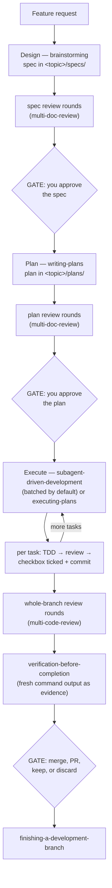
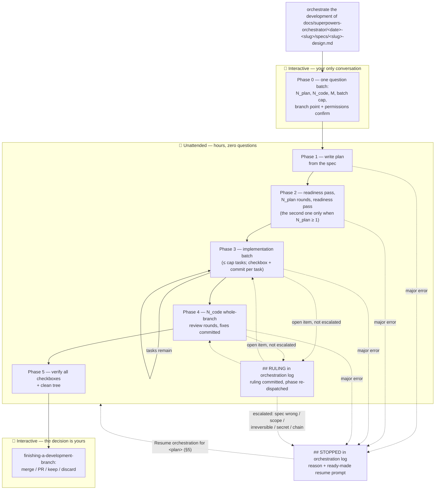

# Superpowers Orchestrator — User Guide

_Guide last reviewed against plugin version **7.24.0**._

This is the day-to-day operating manual for the plugin: which phrases trigger
which workflow, what the pipelines look like end to end, and what to do when
something is interrupted. For the feature pitch and full skills catalog, see
the [main README](../../README.md). For internals, see
[docs/architecture/](../architecture/).

The guide is organized by intent — find the section matching what you want to
do. Authoritative parameter detail always lives in each skill's `SKILL.md`;
this guide documents the stable user surface and links there.

---

## Contents

1. [Installing and staying up to date](#1-installing-and-staying-up-to-date)
2. [Quick start — your first session](#2-quick-start--your-first-session)
3. ["I want to build a feature" — the main pipeline](#3-i-want-to-build-a-feature--the-main-pipeline)
4. ["I want an autonomous run" — orchestrating development](#4-i-want-an-autonomous-run--orchestrating-development)
5. ["My run was interrupted" — resuming and recovering](#5-my-run-was-interrupted--resuming-and-recovering)
6. ["How does it remember?" — the memory system](#6-how-does-it-remember--the-memory-system)
7. [Context pressure — the "memory almost full" safety gate](#7-context-pressure--the-memory-almost-full-safety-gate)
8. [Phrase cheat-sheet](#8-phrase-cheat-sheet)
9. [Troubleshooting](#9-troubleshooting)

---

## 1. Installing and staying up to date

Install and update commands for every platform (Claude Code, Cursor,
OpenCode, GitHub Copilot CLI, and Codex, which is no longer supported) live in the [main README's Installation
section](../../README.md#installation), which also records that only Claude
Code and GitHub Copilot CLI have actually been used — one source of truth, not duplicated
here. What the README doesn't tell you:

**You run the installed copy, not a checkout.** Sessions load the plugin from
`~/.claude/plugins/cache/superpowers-orchestrator/…`. If you've cloned this
repository, editing a skill there changes nothing in your live sessions until
the plugin itself is updated — a perennial "my change didn't work" trap for
contributors.

**Updates are two steps in Claude Code**: refresh the *marketplace* (the
version catalog), then update the *plugin* — or enable auto-update for the
marketplace and forget about it. After any update, verify with a new session:
the version is in the plugin's install path and its `VERSION` file.

**After each update, re-run the statusline bridge installer** if you use it
(§7): `tools/install-statusline-bridge.sh` refreshes the version-independent
copy under `~/.claude/statusline/` that your `settings.json` points at.

Platform capabilities differ — §4's orchestration runs on Claude Code only.
Codex and Cursor lack the nested subagent dispatch it requires, and Copilot
CLI and OpenCode have never run it, so the skill is written to refuse on all
four (not observed, since the skill has not been run there). See
[docs/platforms](../platforms) for per-platform notes.

## 2. Quick start — your first session

When a session starts, the plugin loads the first part of its workflow router
(`using-superpowers`; the rest loads on demand through the Skill tool). You don't invoke anything — you just describe what you
want, and every technical request is classified into one of three tiers
before any work begins:

| Tier | What qualifies | What happens |
| --- | --- | --- |
| **Micro** | Typo fix, single rename, 1-line config change | Just done — no ceremony |
| **Lightweight** | ≤ ~2 files, no new behavior, no cross-module risk | Fast path: implement + verify |
| **Full** | New behavior, anything touching gates/triggers, user-visible changes, shared files | The §3 pipeline, starting at design |

The classification errs deliberately toward **full**: an unnecessary design
round costs minutes, while skipping design on a task that needed it ships a
gap. If your "small tweak" lands in brainstorming and you disagree, say so —
the router's classification is a proposal, and you can override it.

Behind the scenes, the plugin works through two mechanisms, and knowing the
difference helps you read the rest of this guide:

- **Skills** are instruction files that Claude reads and follows — every
  workflow in this guide (brainstorming, plan writing, reviews,
  orchestration) is a skill.
- **Hooks** are small programs that Claude Code itself runs automatically at
  fixed moments: when a session starts, when you submit a prompt, just
  before a shell command executes, when Claude finishes responding. A skill
  depends on Claude choosing to follow it; a hook runs no matter what. That
  is why the safety checks (blocking dangerous commands, protecting secret
  files), the automatic memory recall (§6), and the context-pressure gate
  (§7) are hooks — they must work even when Claude is busy or wrong. You
  never invoke a hook yourself; you only see their effects.

Three things worth knowing on day one:

- **Naming a skill is a command, not a hint.** "Use brainstorming",
  "/multi-code-review", "run verification" — any skill named in your prompt
  is invoked as-is, never re-improvised. Two exceptions: `/handoff` and
  `/pickup` (§6) start only when you type the slash command yourself.
- **The session reads your project memory first** (§6): `state.md` for
  work in progress, `known-issues.md` for already-solved errors,
  `project-map.md` for orientation. A project with history starts already
  informed — nothing has to be re-explained.
- **One repo, one working session.** Parallel sessions in *different*
  projects are completely fine. In the *same* repo checkout, only one
  session should be doing work (editing, executing plans, committing) —
  two writers share one working tree and one git index, so they race each
  other's commits, trip each other's clean-tree checks, and overwrite each
  other's `state.md`. A second read-only session (questions, review) is
  harmless. If you truly need two sessions writing in one repo, use git
  worktrees (the `using-git-worktrees` skill): separate working trees on
  separate branches, zero interference.

Example session, both tiers at once: "fix the typo in the install banner" is
done in one edit, no skills; "add a `--json` flag to the export command" gets
routed to `brainstorming`, which asks its questions in one batch and writes a
short spec for your approval before any code exists.

## 3. "I want to build a feature" — the main pipeline

Every feature moves through the same five stages. Each stage produces a
**file artifact** and ends at a **gate** — three of them are yours to
approve; the rest run autonomously:



### Where the documents live

Every document of one feature lives in one **topic folder**:

```
docs/superpowers-orchestrator/<YYYY-MM-DD>-<slug>/
  specs/<slug>-design.md                 the design, plus its review log
  plans/<slug>.md                        the plan, plus its review log
  implementation/<slug>-review-log.md    the code review log and fix reports
  <slug>-orchestration-log.md            the orchestration run's record
```

The date is the day the design was created and never changes afterwards. The
topic folder is always anchored at the **repository root** — a sub-project
inside a monorepo gets its documents at the monorepo root, and moving the
folder elsewhere makes every document in it "outside the layout", which stops
the pipeline with a message naming the expected location.

Stage folders appear on first write: a topic that stopped at the spec has only
`specs/`.

The middle of the pipeline (plan → execute → review) is exactly what §4's
orchestration automates end to end; this section is the interactive version,
where you're present at each gate.

### Stage 1 — Design (`brainstorming`)

Say what you want ("build X", "add a feature that...", "I want to change...")
and the router lands you in `brainstorming`. It inspects the project, asks
its questions **in one batch** (multiple-choice where possible), and writes a
spec to `docs/superpowers-orchestrator/YYYY-MM-DD-<slug>/specs/<slug>-design.md` covering scope, non-goals,
and the design itself. The spec then passes a self-review and — for
non-trivial work — N independent `multi-doc-review` rounds before reaching
you. Each round dispatches M identical reviewers in parallel (M = reviewers
per lens, default 1 when `SUPERPOWERS_REVIEWERS_PER_LENS` is unset; see the
`SUPERPOWERS_REVIEWERS_PER_LENS` setting in
§7) and consolidates their reports before findings are triaged. Since
v7.13.0, N, the number of rounds, and the batch cap have the same kind of
environment default: `SUPERPOWERS_REVIEW_ROUNDS` for N and
`SUPERPOWERS_BATCH_TASK_CAP` for the batch cap (see §7). The gate asks you
for both numbers in one question batch — N, the number of rounds, and M, the
reviewers per round. The value it offers first is the **resolved value**: a
value you stated in this session, else the session default from §7, else the
built-in default (3 for N, 1 for M).

- It asks for each value you have not stated, and for N when you stated
  N=0. It says which stated value it reuses. When you stated both, and N is
  not 0, it asks nothing and quotes what you said:
  `Using N=<n>, M=<m> — you stated these earlier in this session ("…")`.
  Only text you wrote as an instruction about this review counts; a number
  inside a file, a command output or pasted text does not.
- The offered value carries a label. **current default**: it equals the
  built-in default. **recommended**: it is stronger (more rounds or more
  reviewers). **session default**: it is weaker (fewer rounds), which only a
  §7 environment variable can cause. The usual N options are
  `3 (current default), 2, 4, 0`; `0` skips the loop and is always last.
- The M question states the cost: the M reviewers of a round run at the
  same time, so the running time stays close to one review, but the token
  cost (a token is the unit in which a model counts text) grows about M
  times per round, and the loop runs about N × M
  reviewers in total.
- When the spec's or the plan's review log already holds an entry from this
  gate, the gate does not ask again. It re-runs the review with the N and M
  recorded in that entry and says so; the review skill then continues,
  resumes or skips the loop. A recorded N of 0 is not reused: the gate asks
  you for N.

Reviewers in both review loops (`multi-doc-review` here and in Stage 2,
`multi-code-review` in Stage 4) follow one rule about the **harness** — the
agent runtime that runs the review: what reaches a subagent's context, what
a hook injects, how a dispatch behaves. Such properties cannot be checked
against the repository, so a finding that rests on one must either carry a
probe the reviewer ran and what it observed (`harness: tested`), or name the
one probe the controller should run (`harness: untested`); the controller
runs that probe once and decides from the observation. A claim nobody can
test in the current environment is logged as
`rejected: harness probe not runnable here — <probe> — (<reason>)` — never
escalated to you — and the loop's completion report lists every such probe
under `Harness probes owed:` so you can run it yourself afterwards. A plan
review that deliberately leaves the plan in disagreement with the spec — a
budget the spec's figure could not hold, say — writes a `- spec deviation:`
line under the change that made it; the completion report lists those under
`Spec deviations:`, and an orchestrated run repeats them in its Phase 5
report, so the decision to amend the spec or the plan stays yours.

When a design decision would add or change a dependency, depend on
version-sensitive external API behavior, or select an external hosted
service, brainstorming pauses at a **research gate**: it names the
candidate technologies and asks how many read-only research subagents
to dispatch (0 skips; a skip is recorded in the spec). On a non-zero
count, findings are cached under `docs/research/` and committed to the
current branch. The merged evidence report feeds the approach
comparison, and the spec records what the research changed in a
required "Prior art and alternatives" section.

Two rules worth internalizing:

- **Nothing is "too simple to need a design."** Simple projects get a short
  spec — a few sentences — but the approval gate always exists; unexamined
  assumptions in "trivial" work are where the most effort is wasted.
- **The gate is hard.** No code, no file edits, no implementation skills
  until you explicitly approve the spec.

### Stage 2 — Plan (`writing-plans`)

After spec approval, `writing-plans` decomposes it into
`docs/superpowers-orchestrator/YYYY-MM-DD-<slug>/plans/<slug>.md`: tasks with checkboxes, each broken into
steps of one action apiece (~2–5 minutes), with concrete file contents and
exact verification commands an engineer needs — placeholders like "update
logic" are treated as plan failures. Test-driven development (TDD) ordering
is built in: test-writing steps precede implementation steps.

**What binds, and what is only an example.** Each task states a **contract**
— the invariants its artifact must satisfy and the check that would falsify
them (inputs and outputs, for code); a task that creates nothing a contract
could govern says `none — <reason>`. The code blocks and quoted wording
inside the task's steps are *reference implementations*: a good starting
point, not text the implementer must reproduce character for character. Only
two things in a plan bind as written — the plan's `**Global Constraints:**`
block, and a block whose preceding paragraph reads `**Exact content:**
<reason>` where that reason names something outside the plan that the text
must match (a wire format, a file the plan does not itself write). Every
generated plan carries this rule in a `**Body authority:**` note in its
header, so reviewers and executors read it from the plan itself.

**Facts about the repository are tested, not assumed.** Since v7.24.0 the
plan writer runs one command for each fact about the repository that a task
depends on, before it writes that task: whether git tracks a file
(`git ls-files --error-unmatch <path>`), whether git ignores it
(`git check-ignore -v <path>`), whether a file exists, and whether a command
exists. A file or command that an earlier task of the same plan creates is
not such a fact; it is a dependency between tasks. A task that must edit a
git-ignored file leaves that file out of its commit and states that the edit
stays on your disk and does not ship with the branch. Before this rule,
three orchestrated runs planned a commit of the git-ignored `CLAUDE.md`
file; each one stopped a batch or needed a ruling.

The plan gets its own `multi-doc-review` gate before you approve it, and that
gate asks you for N and M in one batch, exactly as the spec gate does; it
also audits the contracts — a task body with no stated contract, a
contract no check could fail ("must work correctly"), and an
`**Exact content:**` marker whose reason points at a file the same plan
writes (a "self-pin") are all findings.
The reviewers of the correctness lens also run the git command for a task
that commits a file or depends on git tracking or ignoring one, and report
the task only when the output contradicts the plan. That lens runs in round
1, in round 5 when N is 5 or more, and in round 9 when N is 9 or more. With
N = 0 no rotating round runs, so only the plan writer's own test applies.
Two limits remain. A task that a review fix adds after round 1 is checked
again only when round 5 or round 9 runs; a task that an `amend plan` answer
adds later in the run is not checked again by a reviewer. A git worktree (a second working folder of the same repository)
has no copy of a git-ignored file, so an edit to such a file made in a
worktree is lost when the worktree is removed.

Since v7.14.0 the plan gate also runs an **Execution readiness pass**: a
review that reads the plan as the agent that will execute it and reports
conflicts that would stop execution — tasks that contradict each other or a
Global Constraint, a task clause that contradicts the spec section it traces
to, a mandated body that breaks its own task's contract, and a sweep of
every site each Global Constraints entry binds. It runs once before the
rotating rounds and, when N is 1 or more, once after them. Each run repeats
until a pass applies no Critical and no Important finding and every reviewer
returned a usable report, at most three passes (one pass when the plan names
no spec the reviewers can find). With N = 0 only the run before the rounds
takes place, and it still takes place. For a plan, add 2 to 6 further passes of M reviewers on top of the N rounds
(1 to 3 when N is 0); where the platform cannot dispatch in parallel, the M
reviewers of a pass run one after another.

A conflict the pass cannot decide — the spec contradicts itself, or the plan
itself mandates something the review rubric calls a defect — is not applied:
it is listed in the review log's `Owed:` block and in the gate's report. It
never stops the run and never asks you a question. In an orchestrated run
the Phase 2 log entry carries only the count (`readiness owed: <n>`), and
the Phase 5 report lists the conflicts themselves.

The later check for an owed conflict is the Pre-Flight Plan Review that
`subagent-driven-development` runs before Task 1, in interactive and batched
mode alike, with or without orchestration. That review looks for tasks that
contradict each other or a Global Constraint, and for defects the plan
mandates; it does not compare the plan with the spec. A plan executed
through `executing-plans` has no Pre-Flight Plan Review, only a general
critical read of the plan before work starts. In that case, and for an owed
conflict where the spec contradicts itself, read the `Owed:` list yourself.

This file is the pipeline's backbone: its checkboxes are the durable
position record that execution ticks and commits task by task (§5).

### Stage 3 — Execute

When you approve the plan, `writing-plans` selects the execution approach
for you and hands you a ready-made paste prompt (the dialogs are quoted in
the `/clear` section below). **In this fork, the recommended and default
approach is `subagent-driven-development` (SDD) in batched autonomous
mode**: a fresh subagent per task, a strict per-task review gate, executed
in resumable batches with a handoff at every boundary — the mode described
in detail just below. The alternatives exist for specific situations:

- **SDD, interactive** — the same per-task subagents and reviews, but it
  stops to ask you about ambiguities instead of journaling them for the
  batch end. Choose it when you want to stay in the loop task by task.
- **`executing-plans` (inline)** — continuous execution inside the current
  session, no subagents. The handoff auto-selects this only when the
  plan's tasks share heavy runtime state that fresh subagents would lose;
  it is the exception, not the default.

Whatever the mode: work happens on an isolated feature branch (never on
`main` without your explicit consent), test-driven development is enforced
for behavior changes, and each task's checkbox is ticked and committed the
moment the task completes.

### Stage 4 — Review and verify

When the last task completes, `multi-code-review` runs N independent
whole-branch review rounds (rotating lenses: correctness, red-team, security,
test quality), each round dispatching M identical reviewers in parallel
(default 1) whose reports are consolidated before triage, with
Critical/Important findings fixed between rounds and an early exit after two
consecutive clean rounds — with M > 1 a round is clean only when every
reviewer returned a usable report. In interactive SDD the gate asks you
for N and M first. In batched autonomous mode it asks nothing: N and M are
the values you stated when the batch run started or that the resume prompt
carries, else the session defaults `SUPERPOWERS_REVIEW_ROUNDS` and
`SUPERPOWERS_REVIEWERS_PER_LENS` (§7), else 3 and 1. For a value you did
not state in that turn, a message of the loop names where the value came
from. One exception: a carried
`N=0` is asked once before the loop starts. Each reviewer here reads the
whole-branch diff, so M
costs more at this gate than at the two document gates. The harness-claims rule from Stage 1
applies here as well: a finding built on an untested claim about the agent
runtime is never escalated to you — the controller runs the named probe
first, or lists it under `Harness probes owed:`. Throughout, any "done" claim
must pass `verification-before-completion` — fresh command output as
evidence, never memory of an earlier run.

Some findings the loop cannot settle by itself: a `user-decision` item (a
finding that needs your decision) or an `unresolved` item (a finding still
open when the loop's own fix attempts are spent). The loop presents each of
them to you once, in its final report; batched autonomous mode records them
and ends the batch instead of asking. When your answer is that a finding
must be fixed, the loop writes your answers in the review log under a
`### Post-loop addendum <n>` heading, runs one fix subagent, and then runs
one re-review of the branch with M reviewers, logged as
`## Round <i> addendum <n> re-review 1`. Since v7.18.0, when that re-review
still leaves a Critical or Important finding, the loop runs one more fix and
a second re-review. The limit is two fixes and two re-reviews for each
addendum. A finding that still stands after the second re-review is logged
`unresolved: addendum re-review` and comes back to you as an open item. In
an autonomous run (§4) the orchestrator gives these answers by its rulings,
and the same limit applies.

Since v7.41.0 a fix subagent never edits the plan file, not even its
reference text. When a finding can only be fixed by a change to the plan, the
fix subagent leaves it unfixed and reports its id back. The loop logs that
finding `unresolved: fix needs a plan edit`, and it comes back to you as an
open item. The loop does not retry that fix. When your answer changes the plan
(`amend plan …; fix it`), the fix your answer orders is dispatched as usual.

Since v7.9.0 the reviewers and the fix subagent receive their instructions
**by pointer**, not as pasted text. The controller (the subagent that runs
the loop) creates one temporary directory outside your repository at the
start of the loop, fills the reviewer prompt into a file there once per
round with a small script, and sends each reviewer a three-sentence message
that names the file. The reviewer reads that file once and follows it; it
is told to read nothing else in that directory. The text a reviewer reads is
the same text it was sent inline before — the template did not change. The
fix subagent is dispatched the same way from its own template. The point is
the controller's context window (the working memory it holds for the whole
loop): before this change, the pasted prompts were 35 to 42 percent of it;
measured on the first run after the change, 8.5 and 9.0 percent. Since
v7.10.0 the orchestrator of an autonomous run (§4) sends its own
controllers their instructions the same way.

### When the review loop's prompt delivery fails

Every failure of that delivery mechanism is **fatal to the loop**: the
controller records the round it owes, if any, and returns
`BLOCKED: <cause>` — the same kind of stop as any other blocked
controller (in an orchestrated run, a `## STOPPED` entry with a resume
prompt; see §4 and §5). It never falls back to pasting the prompt inline.
This was a deliberate decision: a fallback would hide the defect and bring
the old cost back without anyone noticing, while a stop makes it visible
the moment it happens. The causes you can see are:

- the temporary directory could not be created;
- its path was lost from the controller's context, for example after a
  context compaction (explained in §4); the resumed loop creates a fresh
  directory;
- a prompt file was not produced (the script failed or the file is empty);
- a value file could not be written, or was refused twice by the plugin's
  secrets hook;
- the line-by-line secrets probe (described in the first item below) could
  not run;
- no reviewer of a round could read or follow its prompt file.

Four bounded cases are handled inside the loop instead of stopping it:

- **A finding that quotes a credential.** The plugin's secrets hook refuses
  to write a file that contains a credential-shaped string, and its refusal
  names only a kind of credential, never a line. The controller probes the
  file line by line, replaces every refused line by the finding's location
  plus the words `secret-bearing finding, value withheld`, and writes the
  file again once. The finding keeps its id and severity, so the fix
  subagent still removes the credential at that location. A second refusal
  stops the loop.
- **A round whose reviewers all failed for environmental reasons** — a
  usage limit, a tool error, no final message — or all returned a report
  the controller could not parse, is logged `inconclusive` and the loop
  goes on, exactly as before. Only a round in which no reviewer could read
  or follow its prompt file stops the loop.
- **A mistake in the controller's own fill command** (a mistyped argument,
  a missing value) is corrected once; a second failure stops the loop.
- **A prompt file filled with wrong values** may be removed and filled
  again until a pointer to it has been sent; after that it is never
  rewritten.

Two things were not verified in v7.9.0. The first — whether a session
that is not in bypass mode asks for permission before the controller
writes or reads files in that temporary directory — was probed once on
2026-09-06 in auto permission mode, with no prompt (see the permissions
note in §4); other permission modes are untested. The second, the path
form on Windows Git Bash, is still untested.

### Stage 5 — Finish (`finishing-a-development-branch`)

The final gate is always interactive: merge locally, open a PR, keep the
branch for later, or discard it. The pipeline never merges or publishes on
its own — same rule as orchestration.

### Batched autonomous mode

This is the fork's recommended way to execute a plan: SDD running in
batches that survive session boundaries. You can also start it directly on
any existing plan:

```
implement the next 5 tasks of docs/superpowers-orchestrator/2026-08-04-my-feature/plans/my-feature.md
```

A batch executes up to the **task cap** (your stated count; else the
`SUPERPOWERS_BATCH_TASK_CAP` setting, see §7; else 3) fully
autonomously — sequentially, never asking questions mid-batch; a blocker
ends the batch early with the question journaled instead of guessed at.
When the cap comes from the setting, or from the `X=<x>` of a pasted
resume prompt, the batch's first message says so: `Batch cap <c> — the
session default from the <superpowers-defaults> block.` or `Batch cap <c>
— carried by the resume prompt.` At
the boundary it writes a handoff into `state.md` (position, decisions, open
issues, and the exact resume prompt), tells you to `/clear`, and you paste:

```
Resume the plan at docs/superpowers-orchestrator/2026-08-04-my-feature/plans/my-feature.md (batched autonomous mode, X=<x>, N=<n>, M=<m>)
```

`X=<x>`, `N=<n>` and `M=<m>` appear only when you stated that value when
the batch run started — omit whichever you did not state.

Fresh session, cached-context costs gone, next batch begins. The
context-pressure gate of §7 checks only prompts that match its execution
patterns, such as "execute the plan"; it does not check the batched-mode
prompts shown above, so start each batch in a fresh session. Recovery semantics —
including crashes mid-batch — are §5's batched-execution case.

### `/clear` between the gates — and why it costs you nothing

The pipeline actively recommends starting execution in a **fresh session**,
and ending each batch with `/clear`. This isn't housekeeping; it's one of
the plugin's research-backed principles (see the main README's
[Research-Informed Design](../../README.md#research-informed-design)
section): models over-condition on their own previous output, and
a window full of design debate and dead reasoning measurably degrades the
work that follows. By the time the plan is approved, the planning
conversation is no longer useful — it only takes up memory that the first
batch needs, spending the context budget before Task 1 even begins.

`/clear` is safe *because of the memory system* (§6). Every gate writes its
outcome to files before asking you anything: the spec and plan are committed,
`state.md` carries position and decisions, and the next session reads them
back automatically at startup. The conversation is disposable; the files are
the state. You never lose work by clearing — you only shed noise.

You don't have to remember any of this — the skills tell you at each gate.
These are the actual dialogs:

**Spec approval gate** (end of `brainstorming`):

> Spec written and saved to `<path>`. The review rounds are complete. Choose how to continue:
>
> 1. **Review it here** — request changes, or approve to continue to `writing-plans` in this session.
> 2. **Autonomous pipeline** — run `/clear` (the spec and its review log stay on disk), then paste:
>
>        orchestrate the development of <path>
>
>    orchestrating-development runs plan writing, plan reviews, batched implementation, and code reviews unattended, and stops before any merge or PR. A fresh session is recommended because the pipeline then starts with the full context window.

**Execution handoff** (end of `writing-plans`, after plan approval):

> Plan saved to `docs/superpowers-orchestrator/<date>-<slug>/plans/<slug>.md`. Ready to execute with
> **[Subagent-Driven / Inline Execution]** (`<N>` tasks[, `<one-word reason>`]).
>
> Recommended: start execution in a fresh session (`/clear` in Claude Code)
> — this session's planning context is no longer needed for execution and
> only spends the first batch's context budget before Task 1 begins. The
> plan file and
> `state.md` carry everything execution needs. Then paste:
>
> `Use subagents in batched autonomous mode on docs/superpowers-orchestrator/<date>-<slug>/plans/<slug>.md`
>
> Or reply here to execute in this session, or say "inline" / "subagent"
> to switch.

When Subagent-Driven is selected, the message also offers the interactive
prompt `Use subagents to implement docs/superpowers-orchestrator/<date>-<slug>/plans/<slug>.md`,
after the batched one. When Inline is selected, the prompt is
`Execute the plan at docs/superpowers-orchestrator/<date>-<slug>/plans/<slug>.md`.

**Batch boundary** (end of each batch in batched autonomous mode):

> Batch complete (`<t>` tasks). Context at P%. To continue: run `/clear`, then
> paste:
> "Resume the plan at `<plan-path>` (batched autonomous mode, X=<x>, N=<n>, M=<m>)"
>
> (`X=<x>`, `N=<n>` and `M=<m>` appear only when you stated that value
> when the batch run started.)

One rule matters when following these dialogs: **paste the prompts
verbatim.** They're tuned to the router's scoring, not just written to be
readable — a reworded prompt can score below the routing threshold (fresh
session lands in no skill at all) or drop the "subagents"/"batched" wording
and silently fall through to inline execution.

## 4. "I want an autonomous run" — orchestrating development

The `orchestrating-development` skill drives an **approved spec** through the
entire pipeline with no interaction after setup: plan writing → N plan-review
rounds → batched implementation → N whole-branch code-review rounds. It runs
for hours unattended, settles the review findings and blocked tasks that
collide with the plan by its own recorded rulings (since v7.8.0), stops
only for a closed list of reasons, and always ends *before* merge —
creating the PR or merging is your call, made interactively at the end via
`finishing-a-development-branch`.

What it will **never** do: merge or open a PR on its own, ask you questions
mid-run, stash or commit unrelated changes it finds in your tree, or silently
reconcile inconsistent state — anything suspicious is a stop, not a guess.



Authoritative detail:
[`skills/orchestrating-development/SKILL.md`](../../skills/orchestrating-development/SKILL.md).

### Prerequisites

- **An approved spec** in `docs/superpowers-orchestrator/<date>-<slug>/specs/` — usually produced by `brainstorming`
  (§3). Orchestration starts *from* a spec; it does not design one.
- **Spec content, when it matches the prior-art trigger predicate** (§3):
  a "Prior art and alternatives" section, or the exact sentence "No
  decision in this design matched the prior-art trigger predicate."
  Missing both stops Phase 0 before planning starts.
- **Nested subagent dispatch.** The pipeline needs nested subagent dispatch
  (the orchestrator spawns controllers, which spawn workers). The pipeline
  has only ever run on Claude Code. On any other platform, Copilot CLI
  included, the skill refuses with one line.
- **A clean working tree**, except the spec and its review-log sidecar
  (brainstorming leaves those uncommitted; orchestration commits them for
  you). Any other dirt stops setup — it will not touch your unrelated changes.
- **Pre-authorized permissions** — see the Phase 0 warning below.

### Starting a run

Recommended: start from a fresh session (`/clear`) — the spec and its review
log live on disk, so nothing is lost, and the pipeline gets the full context
window. Then paste:

```
orchestrate the development of docs/superpowers-orchestrator/2026-08-04-my-feature/specs/my-feature-design.md
```

The spec approval gate at the end of `brainstorming` (§3) offers this same
prompt with your spec's path already filled in.

**Usage limits.** Start a long run in an ordinary interactive session, in
the foreground. When a claude.ai usage limit stops that session, Claude Code
waits for the reset and then continues the run by itself. This is the
setting `autoContinueAtUsageLimit`; the Claude Code documentation says that
it is "on by default in interactive sessions signed in with a claude.ai
subscription" and requires Claude Code 2.1.234 or later. Put
`"autoContinueAtUsageLimit": true` into `~/.claude/settings.json` anyway:
18 limit stops of orchestrated runs on Claude Code 2.1.245 to 2.1.258 did
not continue by themselves, and the cause is not known. The controller that
was running when the limit hit stops too; the orchestrator retries it once,
as it retries any controller that died of its environment, and a second
stop ends the run. Claude Code does not wait by itself in several
documented cases, among them a background session (`claude --bg`, agent
view), a `claude -p` run and a reset more than 24 hours away (a weekly
limit). Exiting the session or `/clear` ends a wait, and when the limit
reset during a sleep of more than about 30 minutes, Claude Code waits for
Enter. The full list is on the documentation page "Wait for a usage limit
to reset" (<https://code.claude.com/docs/en/interactive-mode>). In such a
case, type `continue` in the open session after the reset; when the
session has ended, send `Resume orchestration for <plan path>` in a new
session (§5). The automatic continuation was observed once, in an ordinary
session on 2026-09-16; it has not yet been observed in an orchestrated run.

### Phase 0 — the only conversation you'll have

Setup asks everything in **one question batch**. After you answer, the next
thing you hear is completion or a stop.

| Question | Range | Default |
| --- | --- | --- |
| `N_plan` — plan-review rounds | 0–10 (0 = no rotating rounds; the Execution readiness pass still runs) | 3, or the value of `SUPERPOWERS_REVIEW_ROUNDS` |
| `N_code` — code-review rounds | 0–10 (0 = skip) | 3, or the value of `SUPERPOWERS_REVIEW_ROUNDS` |
| `M` — reviewers per lens: identical reviewers dispatched in parallel per review round, for both loops | 1–5 | 1, or the value of `SUPERPOWERS_REVIEWERS_PER_LENS` |
| Batch cap — tasks per implementation batch | 1–5 | 3, or the value of `SUPERPOWERS_BATCH_TASK_CAP` |

One `SUPERPOWERS_REVIEW_ROUNDS` value supplies the offered default for both
`N_plan` and `N_code`; you may still answer the two questions differently.
Each offered value carries the same label as at the review gates (§3,
Stage 1): **current default**, **recommended** or **session default**. For
the batch cap the direction is reversed, because a smaller cap gives you
more checkpoints between batches: a cap below 3 is **recommended**, and a
cap above 3 is **session default**.

The same batch asks for two confirmations:

- **Branch point** — it states the branch and commit the feature branch will
  be cut from. Cutting from a non-default branch requires explicit
  confirmation (default: abort).
- **Permissions** — the run is unattended, and **a single permission prompt
  stalls it indefinitely**: a subagent waiting on an approval dialog nobody
  will answer. Before confirming, make sure the session can run the
  pipeline's edit/Bash/Agent calls without prompting (pre-approve in
  `.claude/settings.json`, or run with permissions accepted for the session).
  This is the most common cause of a "hung" run. Since v7.9.0 the code
  review loop, and since v7.10.0 the orchestrator itself, write and read
  prompt files in a temporary directory **outside** the repository
  (created with `mktemp -d`), so a pre-approval limited to the repository
  path is not enough on its own. A Write and a Read under such a directory
  must not prompt: this was probed once on 2026-09-06 in auto permission
  mode, and no prompt appeared. Other permission modes are untested; if
  your session prompts for those calls, pre-approve them before starting.

### What happens while you're away

| Phase | What it does | Artifact |
| --- | --- | --- |
| 1 — Plan | Writes the implementation plan from the spec | `docs/superpowers-orchestrator/<date>-<slug>/plans/<slug>.md` |
| 2 — Plan review | An Execution readiness pass, N independent review rounds with findings applied between rounds, then a second readiness pass when N is 1 or more | plan review-log sidecar |
| 3 — Implementation | Tasks in batches of ≤ cap; each task test-driven, reviewed, and committed with its checkbox ticked | commits on `feature/<slug>` |
| 4 — Code review | N whole-branch review rounds with fixes applied | `<topic>/implementation/<slug>-review-log.md`, committed |
| 5 — Completion | Verifies every checkbox and a clean tree, then hands over | final report |

Each phase runs in a fresh controller subagent; the orchestrator itself stays
lean and moves all state through files committed at every boundary — which is
what makes interrupted runs recoverable (§5).

Since v7.10.0 the orchestrator hands each controller its instructions **by
pointer**, the same way the code review loop hands them to its reviewers
(§3, Stage 4). At the start of the session it creates one temporary
directory outside your repository with `mktemp -d`. Before each dispatch it
fills the phase's controller template once, with the same small script the
review loop uses, into a numbered file in that directory, checks that the
file is not empty, and sends the controller a three-sentence message that
names the file. The controller reads that file once and follows it; it is
told to read nothing else in that directory. A retry of the same dispatch
resends the same pointer to the same file. A re-dispatch that carries
answers — after an in-run ruling, or on resume — is a new file, with the
answers in a small value file next to it. Before v7.10.0 the whole template
(94 to 249 lines) was pasted into every dispatch and every retry, which on
one measured run took about a quarter of the orchestrator's context window.
The directory's path is never written to the log or to `state.md`; if the
orchestrator loses it (after a context compaction, typically) it creates a
new directory and continues — that is not a failure.

A **context compaction** happens when a session's context window fills:
Claude Code replaces the earlier conversation with a short summary. After a
compaction, Claude Code attaches again only the first 20,000 characters
(about 5,000 tokens) of a skill's text, and the orchestrator skill is about
153,000 characters long. Since v7.19.0 the top of the skill tells an
orchestrator session that continues from a compaction summary to re-read,
from the installed skill file, the section it was executing (Phase 3, Phase
4, the in-run rulings, or Resume). It then checks the ruling record (the file
in which the orchestrator writes each ruling) for a ruling that was written
but not committed, before it acts on the next controller return. You may see
these reads in the terminal; they are expected. This recovery was tested on
2026-09-16 with `tests/claude-code/compaction-probe.md`, which runs without a
person: ten compactions in one run, and every ruling written after one was
complete and committed in the right order. The session skipped the re-read
after four of them, trusting summaries that restated the procedure or said
the re-read was already done, so since v7.30.0 the guard says such a claim
never counts.

### Watching progress

The orchestration log is the run's visible record:
`docs/superpowers-orchestrator/<date>-<slug>/<slug>-orchestration-log.md`, committed at every boundary.
Tail it from another terminal:

```
# Orchestration Log — my-feature

_Invocation 1 — 2026-08-08 — spec docs/superpowers-orchestrator/2026-08-04-my-feature/specs/my-feature-design.md — N_plan=3 N_code=3 M=1 cap=3 — branch feature/my-feature — BASE a1b2c3d_

## Phase 1 — Plan — DONE — 2026-08-08
plan: docs/superpowers-orchestrator/2026-08-04-my-feature/plans/my-feature.md — 7 tasks

## Phase 2 — Plan review — rounds 2 — converged — unresolved 0

## Phase 3 — Batch 1 (tasks 1–3) — COMPLETE — commits a1b2c3d..e4f5a6b
- Task 1: complete — added parser with regression tests
```

With `N_plan = 0` the Phase 2 line reads
`## Phase 2 — Plan review — rounds 0 (N_plan=0) — cap — unresolved 0`,
because the Execution readiness pass still ran (since v7.14.0). A log
written by an earlier release shows `## Phase 2 — Plan review — skipped
(N_plan=0)` instead; both shapes mean Phase 2 is complete.

The plan's task checkboxes are the other live signal — each tick is committed
the moment its task completes.

Since v7.8.0 the log also carries `## RULING <n>` entries. Each one records
a decision the orchestrator made inside the run — a review finding that
collided with the plan, or a task blocked on a plan conflict or a question
— with one `Items:` line per item, its class (`forced`, `design` or
`escalated`), the answer given, the forked reviews used, and the phase it
re-dispatched. The full reasoning is in
`docs/superpowers-orchestrator/<date>-<slug>/plans/<slug>-open-decisions.md`,
one `## Ruling <n>` entry per item, committed together with the log entry
before the phase continues.

Since v7.17.0 the `Re-dispatch:` line of a `## RULING` entry shows the two
limits described in "When it stops instead of finishing" below:
`Re-dispatch: phase <p>, in-run resume <r> of 3, return <t> of 6`. Both
numbers include the entry itself. A fix-only ruling (every answer begins
`fix it` or `accept`) repeats the previous `<r>` and adds one to `<t>`. When
at least one item of a return is escalated to you, the entry reads
`Re-dispatch: none — escalated`.

### When it stops instead of finishing

Any major error — a blocked controller, unresolved review findings, a plan
inconsistency, the branch changed under it — appends a `## STOPPED` entry to
the log with the reason, a pointer to the detail file, and the exact resume
prompt to use. Nothing is lost: everything up to the stop is committed. A
Phase 4 controller that could not deliver a prompt to its reviewers or fix
subagent is one such blocked controller (since v7.9.0; see "When the review
loop's prompt delivery fails" in §3): its `BLOCKED` cause names the file or
directory that failed, and the fix commits of the completed rounds are
already on the branch.

Since v7.10.0 the orchestrator's own prompt delivery to its controllers
(see "What happens while you're away" above) follows the same fatal rule:
every failure of that mechanism stops the run with a `## STOPPED` entry
naming the cause, and the orchestrator never falls back to pasting the
template inline. The causes you can see are: the temporary directory could
not be created (or was created inside the repository); a prompt file was
not produced (the fill script failed, Node is missing, or the file is
empty); a value file could not be written, or was refused twice by the
plugin's secrets hook; or a controller's final message shows it could not
read or did not follow its prompt file, even after the one retry. Four
things are deliberately *not* such failures and keep their existing
handling: a controller that died of its environment (a usage limit, a tool
error, no final message) gets one identical retry and then the usual stop;
a slip in the orchestrator's own fill command is corrected once; a
controller report the orchestrator cannot parse is a malformed return and
gets one retry; and a temporary directory path lost from the orchestrator's
context is replaced by a fresh directory without a stop.

A review finding that merely differs from a code block the plan showed is
*not* one of these stops: since v7.7.0 those bodies are reference
implementations, so the fix is applied and the run continues. A plan
inconsistency means a genuine conflict — with a task's stated
`**Contract:**`, or with the plan's `**Global Constraints:**` — and since
v7.8.0 even that is not a stop by itself. The orchestrator classifies each
open item of a Phase 4 review return, and each conflict or question behind
a Phase 3 `BLOCKED task=<n>`, and decides it in the run: directly when
only one outcome is defensible, otherwise after two or three forked
reviews under distinct lenses. An item reaches you only when its correct
resolution would change the spec (`spec wrong`), grow the work beyond the
spec (`scope`), need an irreversible or outward-facing action
(`irreversible`), concern an exposed credential (`secret`), or when the
same unit has already been re-dispatched too many times on rulings
(`chain`). The unit is the phase in Phase 4 and the task in Phase 3.
Since v7.17.0 two limits apply to each unit. A *plan ruling* — a ruling
in which at least one answer begins `amend plan` or `plan governs` — uses
one of 3 in-run resumes. Every ruling that re-dispatches the unit, a plan
ruling or a *fix-only* ruling (every answer begins `fix it` or `accept`),
uses one of 6 returns. The return that would be the fourth plan ruling or
the seventh return is not ruled on: its open items are escalated as
`chain` and the run stops. Before v7.17.0 every ruling used one of the 3
resumes, so a series of `fix it` rulings stopped the run at the fourth
return. Both counts start again from zero when you resume a stopped run.
A Critical is never rejected by a ruling, and a decision you
made earlier in the run is never overturned by one. Since v7.11.0 that
second guarantee holds whichever line of the ruling record carries your
answer: an `amend plan` answer you gave to an escalated item is appended
as a `**Follow-up:**` line. When the amended clause carries the
`(amended by ruling <n>)` marker (a Global Constraints entry or an
Exact-content block), it keeps its decided-wording authority just as if
the answer stood on the `**Resolution:**` line. An amended `**Contract:**`
gets no marker, so a later finding against it is triaged as ordinary
text. Before v7.11.0 only the Resolution line was read, so a finding
against a clause you had amended could be dropped as ordinary text.
Since v7.40.0 the quoted clause on that `**Follow-up:**` line is read from
the plan after the resume has made its own edits, so it records the wording
your decision leaves in force. Before that it was copied from the review
log line, which after a fix carries no clause at all, and which after your
own `amend plan` answer still held the older wording — in both cases the
run could later find no match and decide the item itself.

A Phase 3 or Phase 4 stop entry therefore lists two kinds of items: each
escalated item on an `Open:` line with its reason — these are the ones
you answer — and each item the orchestrator already decided on a `Ruled:`
line, which needs no answer. A Phase 4 stop also carries one `Owed probe:`
line for every harness probe the review loop could not run (see Stage 1
in §3) — these probes are yours to run; they are not blockers and need no
answer in the resume prompt. See §5 for resuming, overriding parameters on
resume, and abandoning a wedged run.

Phase 0 itself can also refuse to start, before the log even exists: the
prior-art intake check (see Prerequisites above) reads the spec, and when
it matches the trigger predicate but carries neither the required section
nor the override sentence, orchestration stops and reports directly —
there is no `## STOPPED` log entry, because planning never began. Add the
missing section or sentence to the spec and re-run orchestration.

### On completion

You get a summary with these items. An empty list reads `none`.

- tasks, batches, review rounds and outcomes;
- the harness probes owed by the plan and code review loops;
- the readiness conflicts owed by the plan review (its log's `Owed:` block);
- every `- spec deviation:` line of the plan review log;
- the rulings made in the run: their count, each ruling whose forked
  reviews left a contradiction unsettled, and each ruling whose answer
  begins `accept:`, with a pointer to the ruling record;
- the `Secrets found:` items of the code review loop;
- the three log paths.

Then `finishing-a-development-branch` takes over interactively — merge, PR,
keep, or discard is yours to decide.

## 5. "My run was interrupted" — resuming and recovering

Every long-running workflow in this plugin — orchestrated or not — keeps its
position in **files and git, never in the conversation**. The plan's task
checkboxes are ticked and committed the moment each task completes; commits
land per task; `state.md` carries the narrative. A crash, a killed terminal,
a `/clear`, or a power loss therefore loses at most the work in flight since
the last completed task — everything earlier is already on disk and in
history. Recovery is always the same idea: a fresh session reads the files,
reconciles them against git, and continues at the first genuinely
incomplete step.

What differs is the resume phrase and a few caveats, by workflow:

### Orchestrated runs

Two interruption shapes, one resume phrase:

- **Deliberate stop** (major error): the orchestration log ends with a
  `## STOPPED` entry naming the reason, a pointer to the detail file, and the
  exact resume prompt to paste. When the stop waits on your answers, that
  prompt carries one `[<id>]: <answer>` slot per open item; the stop report
  prints it with each slot filled by the recommended answer.
- **Crash / power loss**: no `STOPPED` entry — the log simply ends at the
  last committed boundary. Resume infers the position from the log, the
  plan's checkboxes, and recent git history.

Either way:

```
Resume orchestration for docs/superpowers-orchestrator/2026-08-04-my-feature/plans/my-feature.md
```

Resume checks out the feature branch, reads the log (authoritative for
parameters and last completed phase), and continues at the first incomplete
phase or batch. It **never re-asks the Phase 0 questions** — parameters come
from the log — but you may override them per-parameter in the resume prompt
(`... with cap=2`), which is also the designed escape when a parameter caused
the stop. Mid-batch, already-completed tasks keep their ticked checkboxes and
commits and are skipped; orphan commits from a half-finished task are
reviewed together with the task's completion, never blindly trusted.

If a stop recorded a blocking question, answer it in the resume prompt;
resume with an unanswered blocker just presents the question and stops again.
A Phase 3 or Phase 4 stop lists the items to answer on its `Open:` lines,
by id, and its `Resume:` line carries one `[<id>]: <answer>` slot per
open item; fill those slots and only those. An override alone (`... with
cap=2`) answers nothing and the run stops again on the same question.
Every option the stop report offers is one the loop will accept: an item
whose clause names binding plan text is offered `plan governs`,
`amend plan: …; fix it: …` or a further escalation, never a bare `fix it`
or `accept`; a Critical item is never offered `accept` or `plan governs`.
The same rules apply to an answer you write yourself. Two open items of one
review invocation can carry the same id (`[I1]`), because ids restart in
every round, in every fix-verification cycle (an extra review of fixes that
no later round has reviewed; at most three per round) and, since v7.18.0, in
every
addendum re-review (§3, Stage 4). When that happens, begin your answer with
a short parenthesis naming the entry it is for — the round, as in
`(this answers the round 4 item on …)`, or the addendum re-review, as in
`(this answers the round 8 addendum 2 re-review 1 item on …)` — so it is
applied to the right finding. Writing the parenthesis when no ids collide
does no harm. The `Ruled:` lines are decisions the
orchestrator already made and recorded — resume carries them forward as
they are. If you disagree with one, answer that id yourself in the resume
prompt: the run then restores the plan clause that the ruling amended,
before continuing. The run does not undo a code fix made under that ruling
itself; the paragraph "A fix made under an overturned ruling", below, says
what happens to it. Since v7.35.0 the run first checks that the clause it
is about to restore has not changed since that ruling: when a later
ruling amended the same clause, the run stops and reports instead of
restoring, because restoring would also remove the later amendment. A
ruling you overturn a second time is recognised as already reverted and
is skipped. When one resume prompt overturns several rulings, the run
takes them from the highest ruling number down. Since v7.40.0 it also makes every
revert before it applies any amendment your own answer asks for, and it
stops when one return amended the same clause twice, because the commit it
restores from predates both amendments. A crash after a ruling was committed but before its
re-dispatch completed is recovered the same way as any other: resume reads
the trailing `## RULING` entry and re-dispatches the phase with the same
answers.

Since v7.41.0 a resume of a Phase 3 or a Phase 4 stop reads the plan file's
uncommitted changes before it writes anything. The only change it accepts is
a ticked or unticked task checkbox. Any other changed line is a plan edit
that an earlier session wrote and did not commit, because that session ended
first. No record says which answer that edit belonged to, so the run does not
complete the edit and does not keep it. It stops, writes nothing, and its
report names the changed lines. The way out: restore those plan lines to
their committed text, then send the same resume prompt again. A resume of a
Phase 1 or a Phase 2 stop does not make this check, because those phases
leave the plan file uncommitted on purpose.

**A fix made under an overturned ruling.** A Phase 4 ruling can have a fix
commit: a commit in which the code-review loop changed code under that
ruling. When your answer overturns the ruling, the run makes no code change
itself. It writes `fix <sha> not reverted` into the ruling record, and it adds
one `Minor:` line for each fix commit to the ledger
(`.superpowers/sdd/progress.md`, the progress file of the run). The line names
the fix commit and the ruling, and it asks a reviewer to check the branch's
code against the restored clause and to report code that contradicts the
clause as a finding. The restored
plan clause forces a new code review of the whole branch. The reviewers of
its first round receive that ledger line. The review is expected to report
the code that contradicts the restored clause, and its fix subagent is then
expected to remove the wrong code in a normal `review fixes` commit. This
outcome is not certain. A reviewer can decide that the code may ship as it
is. There is also one limit: when the latest review-log entry has no
completion marker, the run resumes that entry at its next round, and rounds
after round 1 do not receive the ledger line. For both cases, the Phase 5
report lists every `fix <sha> not reverted` item with its ruling number, the
sha and the plan location of the restored clause, so you are the last check
of that code. Until then the
branch keeps the change, and the record line and the ledger line make it
visible. Versions v7.44.0 to v7.49.0 tried to revert such a fix commit
automatically with `git revert`; that mechanism was removed, because it never
ran in a real run and its safety checks could never cover every state of a
working tree. A record written by one of those versions can hold
`fix <sha> not reverted` or `fix <sha> reverted`; the run no longer acts on
either.

**Interrupted during plan writing or a review round?** Resume re-enters any
phase whose completion entry never made it into the orchestration log, but
how much is redone differs:

- **Plan writing (Phase 1)** is only durable once the finished plan is
  committed. A crash mid-write leaves at most a partial, uncommitted plan
  file — that's the dirty-tree case below: discard it, resume, and the plan
  is rewritten from the spec. Nothing done is lost, because nothing was
  finished.
- **Review loops (Phases 2 and 4)** are durable *round by round*. Every
  completed round is recorded in the loop's own review log before the next
  begins, and Phase 4's fixes are committed as they're applied — so the
  resumed loop picks up at the next round rather than restarting from
  round 1 (even a partially-used fix-verification cycle budget is recovered
  from the log). Only the round in flight is lost; if it died mid-edit,
  its uncommitted changes are again the dirty-tree case — typically you
  discard them and that round simply re-runs. A resumed Phase 4 controller
  creates its own fresh temporary directory for prompt files; nothing from
  the stopped controller's directory is reused, so a stale or missing
  prompt file from the old run cannot affect the resumed loop. Since
  v7.10.0 the resumed orchestrator session does the same for its own
  controller prompts: it creates a fresh directory before its first
  re-dispatch and fills the stopped phase's prompt there, with your resume
  answers in a value file next to it.

  A Phase 2 readiness pass is recorded in the same review log under its own
  `## Readiness` heading, so a resumed loop continues from the pass or the
  round it stopped at, never from the beginning.

To tear down a wedged or superseded run instead of resuming it:

```
Abandon orchestration for docs/superpowers-orchestrator/2026-08-04-my-feature/plans/my-feature.md
```

(confirms once, then deletes the feature branch — refusing if it's merged or
checked out elsewhere).

### Batched plan execution (SDD batched autonomous mode)

Batches end with a handoff written to `state.md` containing verbatim resume
instructions. After `/clear` (or a crash), paste:

```
Resume the plan at docs/superpowers-orchestrator/2026-08-04-my-feature/plans/my-feature.md (batched autonomous mode, X=<x>, N=<n>, M=<m>)
```

`X=<x>`, `N=<n>` and `M=<m>` appear only when you stated that value when
the batch run started — omit whichever you did not state.

Resume reads `state.md`, then **reconciles against the authoritative
record**: plan checkboxes + git history. `state.md` is narrative and may be
one batch stale — that's expected. The reconciliation even heals the classic
crash window: a task interrupted *between* its commit and its checkbox tick
is detected in `git log`, its box is marked, and execution advances rather
than redoing (or half-redoing) done work. A blocking question recorded in
`## Open Issues` stops resume until you answer it — the run never executes
past an unanswered blocker.

One safety rule to know: when `state.md` names a *different* plan than
your prompt does, or its plan file no longer exists, resume treats
`state.md` as stale. It asks you nothing: it ignores that file, starts from
the plan your prompt names, and overwrites `state.md` at the end of the
batch. It never resumes from a `state.md` that points at another plan.

### Ordinary sessions

The same file-based durability serves everyday work:

- Ending a session mid-task? Say **`save state`** — `state.md` gets the
  current goal, decisions, and resume instructions for the next session.
- Clearing the context window mid-task? Type **`/handoff`** first. Since
  v7.20.0 it saves state (when the session made decisions) and prints a
  prompt that the fresh session can
  follow without re-deriving what this session found (§6).
- Decisions and rejected approaches accumulate in `session-log.md`, and
  solved errors in `known-issues.md` — both are recalled automatically in
  future sessions (§6).
- A plan being executed non-batched still has its committed checkboxes; a
  fresh session pointed at the plan picks up from the first unchecked task.

### Two caveats

1. **A dirty tree can block an orchestration resume.** If a crash left
   uncommitted changes (a task died mid-edit), resume stops and reports
   rather than guessing what the half-done work meant. Inspect the diff
   yourself, then commit or discard it before resuming. This is deliberate:
   recovery never silently reconciles your working tree. There are two
   exceptions. When the log ends with a `## STOPPED` or `## RULING` entry,
   the check is skipped, because the tree may hold the blocked task's work
   on purpose. Since v7.35.0, a resume that has already changed the plan
   file and then stops puts the replaced clause text back before it
   stops, so the tree cannot hold a half-finished revert that the next
   resume would commit as the blocked task's own work. Uncommitted files under the topic's `implementation/` folder
   or in `plans/<slug>-open-decisions.md` never block, because the resumed
   run commits or repairs them. Batched plan execution and `executing-plans`
   have no clean-tree check at resume, so look at `git status` yourself
   before you paste the resume prompt.
2. **`state.md` and `.superpowers/` are git-excluded.** They survive a crash
   on the same machine, but not a fresh clone or `git clean -fdx`. The
   committed artifacts (plan, checkboxes, the orchestration log, and — for a
   pipeline run — everything under the topic's `implementation/`) are the
   source of truth;
   anything excluded that's lost is reported, never silently reconstructed.

## 6. "How does it remember?" — the memory system

Sessions start with zero conversational memory. Everything that persists does
so through plain-text files — five at your project root, plus the handoff
files under `tmp/docs/` and the work logs under `docs/worklogs/` — readable,
editable, and deletable by you:

| File | Answers | Written when |
| --- | --- | --- |
| `project-map.md` | What exists, key files, critical constraints | You say "map this project"; refreshed when flagged stale |
| `session-log.md` | What was decided, why, and what was *rejected* | "save state", `/handoff`, or the end-of-session decision prompt |
| `known-issues.md` | Errors already solved (symptom → cause → fix) | "save this fix", or after debugging resolves a recurring error |
| `state.md` | Where mid-flight work stands right now | Batch handoffs (§3), "save state", `/handoff` |
| `tmp/docs/<date>-handoff-<slug>.md` | A prompt that lets a fresh session continue the work without re-deriving this one's findings | `/handoff [slug]`, before you clear the context window |
| `docs/worklogs/<slug>.md` | Where one piece of multi-part work stands: its parts, open items, accepted limits and decisions | `/worklog new`; then at each change, by the rules in the file itself; `/worklog` for a full update; `/worklog close` |
| `context-snapshot.json` | What changed just before this session | Automatically at session start |

Before you clear the context window in the middle of work, type `/handoff`
(since v7.20.0). It writes a continuation prompt: a prompt that a fresh
session, with no memory of this one, can follow to continue the work.
`/handoff <slug>` sets the end of the file name (a short lower-case name
with hyphens, such as `row-28`); without it, the skill derives one. The
skill takes the facts from files, not from memory: `state.md`, the last two
saved entries of `session-log.md`, and the previous handoff file, or
`CLAUDE.md` when there is no previous handoff. It writes
`tmp/docs/<date>-handoff-<slug>.md` and never overwrites a file (a taken
name gets `-2`). When the session made decisions, it also saves state. It
replies with the file path and the whole prompt in one code block. It
commits nothing, and it tells you when git does not ignore `tmp/docs/`.
Claude never starts this skill by itself: when you write "clear the
context", the router (§2) suggests the skill, but you type the command.

Since v7.23.0 the first line of a handoff file is a header, for example
`Handoff: written=2026-09-15T16:40+0200 branch=main head=e431ae9`: the time
the file was written with its time-zone offset, the branch, and the short id
of the last commit (`none` when there is no branch or no commit). `/handoff`
can add a second line, `Done when: <condition>`, when a commit alone would
not show that the task is finished. `/pickup` reads both lines. A handoff
written before v7.23.0 has no header, so `/pickup` counts only the commits
made since 00:00 of the date in its file name.

Since v7.23.0, to continue in the fresh session, type `/pickup`. With no
argument it takes the newest handoff file and every unfinished orchestration
run on a local feature branch; if it finds more than one, it lists them with
the exact line to type and stops. `/pickup <handoff path>` takes that
handoff. Before it follows a handoff, a scan compares the repository with
the moment the handoff was written and prints one status. `FRESH` means no
commit since the handoff, no uncommitted change, and the same branch:
`/pickup` follows the handoff. `CHECK` means at least one of those differs:
`/pickup` then compares the new commits, the uncommitted changes and the
branch with the handoff's task. If the task looks done or partly done, or
`/pickup` is not sure, it stops and shows you what it found; otherwise it
follows the handoff. `UNKNOWN` means the scan could not decide (for example, the
folder is not a git repository): `/pickup` tells you what is unknown and
asks whether to continue. The files that `/handoff` itself writes
(`tmp/docs/`, `state.md`, `session-log.md`) do not count as uncommitted
changes. Since v7.52.0, a change under `docs/worklogs/` (a work log, see the
end of this section) does not count either. When the handoff has a
`Done when:` line, `/pickup` tests that
condition first and stops if it is already true. A run is never resumed on
its own: `/pickup` shows the run, asks you once, and on yes sends only the
bare `Resume orchestration for <path>` line — the orchestrator then asks you
for any open answers.

When there is nothing to continue, `/pickup` says so. A run that it cannot
resume safely — two orchestration logs for the same name, or neither a plan
nor a spec — is shown as "needs a human look" with its log paths, and
`/pickup` asks nothing. `/pickup` takes only a handoff path: if you give it
a plan or spec path, or extra text such as `with M=1` or `[I2]: yes`, it
sends nothing to the orchestrator and tells you to type
`Resume orchestration for <path>` yourself, followed by your text if you
gave any.

Known limits of `/pickup`. It finds runs only on local `feature/*` branches
that are not merged into your local default branch. The default branch is
the local branch that `origin/HEAD` names, else `main`, else `master`; when
none exists, every feature branch is scanned. A run that exists only on a
remote branch is not listed, and a run merged on the remote is still listed
until you update your local default branch. A
handoff without a header can be sorted behind an older handoff that has
one. The `Done when:` condition is judged by the model, not by the scan. If
a handoff's `written=` time is later than your machine's clock, new commits
on other branches are not counted. On GitHub Copilot CLI the argument may
not arrive (untested); write the handoff path in the same message.

Recall is mostly automatic. At session start, the plugin adds `state.md`, the
last two saved `session-log.md` entries, `known-issues.md`, and
`project-map.md` to the context, in that priority order, while its output
stays under 10,000 characters (Claude Code keeps a hook's output in context
only up to that size). A file that does not fit is named in one
`<not-injected>` line, and Claude reads it with the Read tool when the task
needs it. A stale map is detected via git, and that notice is always small
enough to be added.
When you submit a prompt, hooks inject any `known-issues.md` and
`session-log.md` entries matching it — so a bug you fixed in March resurfaces
as context the moment you hit it again in August, without you asking.

This is also what makes the pipeline's `/clear` recommendations (§3) free of
cost: since every gate persists its outcome to these files before asking you
anything, a cleared conversation loses only noise — the next session
reconstructs everything that matters from disk.

What you should know as the owner of these files:

- **They're yours to edit.** Wrong or outdated entry? Fix or delete it —
  superseded decisions get marked, not silently overwritten.
- **The log records the "why".** Design docs and code record what was built;
  `session-log.md` records what was *chosen and rejected* — the knowledge
  that otherwise evaporates at session end.
- **`state.md` is disposable once its work is merged**; the others accumulate.
- **`state.md` and `.superpowers/` are git-excluded** (the plugin adds the
  exclude entries itself): they survive crashes on the same machine but not a
  fresh clone or `git clean -fdx` — the recovery caveat from §5.

### Work logs — one tracking document for multi-part work

Since v7.52.0, a **work log** records the progress of one piece of work that
has several parts and lasts many sessions — for example four groups of tests
that you refactor one group after the other. A work log is one Markdown file,
`docs/worklogs/<slug>.md`, and git tracks it. A project can hold several. The
slug is the short name of the work log: lowercase ASCII letters (`a` to `z`),
digits and single hyphens, at most 40 characters, and not one of the command
words `new`, `update` and `close`.

The file has a table of parts, a list of open items, a list of accepted
limits, and a list of decisions. Its header holds its own update rules, so any
session that reads the file can keep it up to date, also on a computer where
the plugin is not installed. An **admission rule** (a rule that decides which
problem becomes an open item) keeps the list of open items short: every other
correct finding gets one line under `## Accepted limits`.

| Command | What it does |
| --- | --- |
| `/worklog new [<slug>]` | Asks for the title, the goal, the "done when" condition, the parts and the admission rule, then writes the file. It never overwrites a file. |
| `/worklog` or `/worklog update [<slug>]` | A full update: compares the file with the session and with the commits made since the file was created, and applies the file's own rules. |
| `/worklog close [<slug>]` | Closes the work log. When a part is not finished or an open item remains, it asks you first. |

Without a slug, `update` and `close` use the only active work log, or ask you
which one. The skill never commits: the work log goes into the next commit that
you ask for. At each session start, after `/clear` and after a compaction (the
automatic shortening of a long conversation), the session-start hook names the
active work logs in one short notice; it never adds their content.

What you should know:

- **Keep the work log on the branch where the work happens.** A session on a
  branch that does not hold the file cannot see it.
- **Commit the work log before you create a git worktree** (a second working
  folder of the same repository). An uncommitted work log is absent there, and
  two edited copies meet in a merge.
- **Commit the work log before an orchestrated run or a whole-branch review.**
  Those tools stop on an uncommitted file that they do not know. While such a
  run is in progress, the work log is not written.
- **`docs/worklogs` must be a real folder**, not a symbolic link: the list of
  active work logs does not follow a folder that is a link.
- A closed work log is reopened by hand: edit its line 1 back to the active
  form, `<!-- Work log: status=active slug=<slug> created=<YYYY-MM-DD> -->`.

## 7. Context pressure — the "memory almost full" safety gate

**The problem, in one sentence.** Claude's working memory for a session —
called the *context window* — has a fixed size, and everything you and
Claude say fills it up; when it is nearly full, answer quality drops, and a
long autonomous run can fail halfway through.

**"Context pressure"** is simply the plugin's name for *how full that memory
is*, as a percentage. An empty session is at 0%; at 100% nothing more fits.
You will see the term in the plugin's messages, which is why it has a name
at all.

**What the plugin does about it.** When you submit a prompt that starts
plan execution — one that contains a phrase such as "execute the plan",
"implement the plan", "run the plan", "follow the plan" or "start
implementing" — the plugin checks the pressure. If the session is already
past the threshold (default **60%** full), the hook tells Claude not to
start yet: Claude must first save `state.md`, tell you that it is
compacting, and run `/compact`. Starting a long batch with little free
memory means the batch dies in the middle, which is worse than restarting
cleanly. The check runs only when a prompt is submitted;
how a batch *ends* is decided by the task cap (§3), not by pressure.

Known limit: the batched-mode prompts of §3 ("implement the next N tasks
of …", "Use subagents in batched autonomous mode on …", "Resume the plan
at …") contain none of these phrases, so the check does not run for them.
Start each batch in a fresh session, as the dialogs recommend.

You can change the threshold in your `settings.json` (a percentage, 10–90):

```json
{ "env": { "SUPERPOWERS_PRESSURE_THRESHOLD": "50" } }
```

The number of reviewers per lens — M, the identical reviewer subagents each
`multi-doc-review` / `multi-code-review` round dispatches in parallel — is set
the same way (an integer 1–5, default 1; restart the CLI after changing it;
an invalid value silently falls back to 1). Honored on Claude Code;
not verified on GitHub Copilot CLI or Cursor; no block is emitted on Codex
or OpenCode:

```json
{ "env": { "SUPERPOWERS_REVIEWERS_PER_LENS": "3" } }
```

The three review gates (spec review, plan review, whole-branch code review)
also ask you for M, offering this value as the default; what you answer
there wins for that review.

Beside it, two more variables are set the same way. `SUPERPOWERS_REVIEW_ROUNDS`
sets N, the number of review rounds each review loop runs (an integer 1–10,
default 3; restart the CLI after changing it; an invalid value silently
falls back to 3). `0` is deliberately not accepted here: it would silently
disable spec review, the plan's rotating review rounds and whole-branch
code review on every
future session — N = 0 stays available only where you state it and see its
effect, in an invocation or at a gate question. `SUPERPOWERS_BATCH_TASK_CAP`
sets how many tasks one Batched Autonomous Mode batch implements before it
stops and writes its handoff (an integer 1–5, default 3; restart the CLI
after changing it; an invalid value silently falls back to 3). Both are
honored on Claude Code; not verified on GitHub Copilot CLI or Cursor; no
block is emitted on Codex or OpenCode:

```json
{ "env": { "SUPERPOWERS_REVIEW_ROUNDS": "5", "SUPERPOWERS_BATCH_TASK_CAP": "2" } }
```

At session start the plugin's start-up hook reads these three variables and
adds one short text section to Claude's context: the
**`<superpowers-defaults>` block**. The block always lists all three values,
with the built-in default in place of an unset or invalid variable. A plugin
message that names "the session default from the
`<superpowers-defaults>` block" means the value came from one of these
variables. Whenever a skill uses such a value without asking you, it says
so in its first or last message.

A value that a running skill has already chosen is kept for the rest of that
run, even after `/clear` or a compaction. On Codex and OpenCode no block
exists (read from the code; not run on those platforms): a value you state in the command still wins, and otherwise the
built-in default applies (1 reviewer per lens, 3 rounds, a cap of 3),
whatever these variables say.

**One complication: the plugin has to guess how big the memory is.**
Different Claude models have different context-window sizes (some 200
thousand tokens, some 1 million). Hooks are not told which one is active, so
without help the plugin assumes the common 200K size. On a 1-million model
that guess makes every reading about 5× too high — a session that is really
13% full is reported as "67% full" and gets blocked for no reason.

**The fix is the statusline bridge — Claude Code only.** The *statusline*
is the small information bar at the bottom of the Claude Code window.
Claude Code feeds whatever command draws that bar a message containing,
among other things, the session's *true* memory size and usage — it is the
only official source of those numbers, and it exists only in Claude Code.
The bridge is a tiny program that sits in that spot, writes the true
numbers to a file the safety gate can read, and passes everything on
unchanged. Install it once — the easiest way is to ask Claude in any
session:

```
Run the plugin's statusline bridge installer (tools/install-statusline-bridge.sh)
```

You do not need a clone of this repository: the installed plugin is a full
copy, so the script is already on your machine (under
`~/.claude/plugins/cache/superpowers-orchestrator/…/tools/`), and Claude knows
where its own plugin lives. If you *do* have a checkout, running
`bash tools/install-statusline-bridge.sh` from the repo root does the same
thing.

The installer copies the bridge to a stable location
(`~/.claude/statusline/`) and prints the exact lines to add to your
`settings.json` — it never edits the file itself. If you already have a
statusline you like (a HUD, a git prompt), the printed snippet uses
**delegate mode**: the bridge records the numbers, then hands the display
job to your existing command, so what you see does not change. Re-run the
installer after each plugin update (§1).

**On other platforms there is no fix yet.** Codex, OpenCode, and Cursor
have no statusline mechanism, so the true memory numbers cannot be read
there — do not try to install the bridge on those platforms. Without those
numbers the gate has nothing to measure, so it does not block anything
there (on Cursor the prompt hook that runs the gate is not wired at all).
Batches still end at the task cap (§3), as on Claude Code. This is derived
from the code; it has not been observed, because none of these platforms
has been run. If a future platform version exposes the numbers, bridge
support can follow.

## 8. Phrase cheat-sheet

The phrases that drive the plugin, in one place. Anything not listed here is
handled by the router (§2) — just describe what you want.

| You say | What happens | Details |
| --- | --- | --- |
| "build / add / change X" | Routed into design → the full pipeline | §3 |
| "implement the next N tasks of `<plan>`" | Batched autonomous execution, cap N | §3 |
| "Resume the plan at `<plan>` (batched autonomous mode, X=<x>, N=<n>, M=<m>)" — X, N, M appear only when stated | Next batch, fresh session | §5 |
| "orchestrate the development of `<spec>`" | Full autonomous pipeline, one setup conversation | §4 |
| "Resume orchestration for `<plan>`" | Continue an interrupted run from its last boundary | §5 |
| "Abandon orchestration for `<plan>`" | Confirmed teardown of a wedged run | §5 |
| "research prior art for `<decision>`" / `/researching-prior-art` | Evidence gathering for one technology decision (normally automatic at §3's research gate) | §3 |
| `/multi-doc-review <doc> [N\|N=<n>] [M=<m>]` | N independent review rounds on a spec or plan, M reviewers per round; a plan also gets an Execution readiness pass before and after them | §3 |
| `/multi-code-review [BASE] [N\|N=<n>] [M=<m>]` | N whole-branch code-review rounds with fixes, M reviewers per round | §3 |
| "save state" / "compress context" | Snapshot to `state.md` + decision log entry | §6 |
| "map this project" | Generate `project-map.md` | §6 |
| "save this fix" | Record symptom → cause → fix in `known-issues.md` | §6 |
| `/handoff [slug]` (type it; Claude never starts it by itself) | Before you clear the context window: writes a continuation prompt to `tmp/docs/<date>-handoff-<slug>.md`, saves state when the session made decisions, and prints the prompt to copy | §6 |
| `/pickup [handoff path]` (type it; Claude never starts it by itself) | In a fresh session: continues from the newest handoff or a named one after checking that it is still current, or lists unfinished orchestration runs and asks before resuming one | §6 |
| `/worklog new [<slug>]`, `/worklog`, `/worklog close [<slug>]` | Create, fully update or close a work log: the tracking document of one piece of multi-part work, under `docs/worklogs/` | §6 |
| "use `<skill>`" / `/<skill>` | Direct invocation of a skill by name; `/handoff` and `/pickup` start only as slash commands | §2 |

(This table is release-maintained — if a phrase here doesn't work, your
installed plugin version and guide version have probably diverged; check §1.)

## 9. Troubleshooting

Symptom-first, from real support cases:

**A skill didn't trigger automatically.** Auto-routing only suggests skills
registered in the plugin's routing rules (`hooks/skill-rules.json`), and
keyword matching is deliberately conservative. The reliable path always
works: name the skill (§2) — "use refactoring", `/multi-code-review` — and
it's invoked directly.

**I edited a skill but behavior didn't change.** You edited a checkout;
sessions run the installed copy under `~/.claude/plugins/cache/`. Update or
reinstall the plugin, then start a fresh session (§1).

**My unattended run has been silent for an hour.** Almost always a
permission prompt: a subagent asked for an approval nobody is watching for,
and the run stalls indefinitely — this is exactly what §4's Phase 0
permissions confirmation exists to prevent. Check the terminal for a pending
dialog; after answering it, let the run continue or stop it and resume (§5).
The other cause seen in practice — a controller subagent that ended its
turn "waiting for" a reviewer and never resumed — is closed in v7.5.0;
if you still see it, the installed copy is older than that (§1). Until
you update, sending the stalled controller a message resumes it.

**I updated, but the plugin is still the old version.** Two-step update
half-done (marketplace refreshed but plugin not updated, or vice versa — §1),
or the marketplace pointer reverted to a stale repository. Verify what's
actually installed: the plugin's install path and its `VERSION` file must
both show the expected version; if not, re-run both update steps and check
the marketplace entry points at the right repo.

**"Context pressure" blocks me from starting plan execution.** The §7
gate. It checks only prompts that name plan execution, such as "execute the
plan", never the batched-mode prompts. When it fires, Claude saves
`state.md` and runs `/compact` before it starts. If you're on a large-window
model and the number looks absurd, the gate is likely falling back to a 200K
assumption — install the statusline bridge (§7).

**A review report says `Harness probes owed:` with one or more items.** A
reviewer made a claim about the agent runtime that nobody could test in that
environment, so the finding was rejected instead of stopping the run (§3,
Stage 1). Run the named probe yourself; if it confirms the claim, reopen the
finding by hand — nothing in the run is waiting on it.

**My run stopped with `BLOCKED: prompt file ... not produced` (or
`prompt directory could not be created`, `prompt directory path lost from
the controller's context`, `value file ... could not be written`,
`value file ... refused twice by protect-secrets`, `secrets probe could not
run`, `no reviewer of round <i> could use its prompt file`).** The
code review loop could not hand a prompt to its reviewers or fix subagent
through the temporary directory it uses since v7.9.0, and it stops instead
of pasting the prompt inline by design (§3, "When the review loop's prompt
delivery fails"). Check the cause text: a missing or unwritable temporary
location, Node not runnable, or a permission dialog on a write or read
outside the repository (§4, Phase 0, Permissions). Fix the environment, then
resume (§5); the completed rounds and their fix commits are kept.

**My orchestration log ends with `## STOPPED` and a cause that begins
`prompt directory could not be created`, `prompt file ... not produced`,
`value file ... could not be written`, `value file ... refused twice by
protect-secrets` or `prompt file ... not read by ...`.** The orchestrator
itself could not hand a controller its prompt through the temporary
directory it uses since v7.10.0, and it stops instead of pasting the
template inline by design (§4, "When it stops instead of finishing"). The
likely causes are the same as in the item above: a missing or unwritable
temporary location, Node not runnable, or a permission dialog on a write or
read outside the repository. A `refused twice by protect-secrets` cause
means the answer text still contained a credential-shaped string after the
orchestrator withheld the refused lines once; rewrite that answer so it
names the location of the secret only. Fix the cause, then resume (§5): the
resumed session creates a fresh directory, and everything committed before
the stop is kept.

**The code doesn't match what the plan showed.** Expected, in most cases.
Since v7.7.0 a plan's code blocks are reference implementations; what the
implementation must satisfy is the task's `**Contract:**` field. Only the
plan's `**Global Constraints:**` block and blocks marked `**Exact
content:**` are reproduced literally. If a divergence breaks a stated
contract, that *is* a defect — report it against the task.

**Something orchestration-specific went wrong.** §5 covers stops, crashes,
resumes, and teardown; the orchestration log's `## STOPPED` entry names the
blocker and the detail file.

Platform-specific limits (Codex, OpenCode, Windows) are documented in
[docs/platforms](../platforms).
